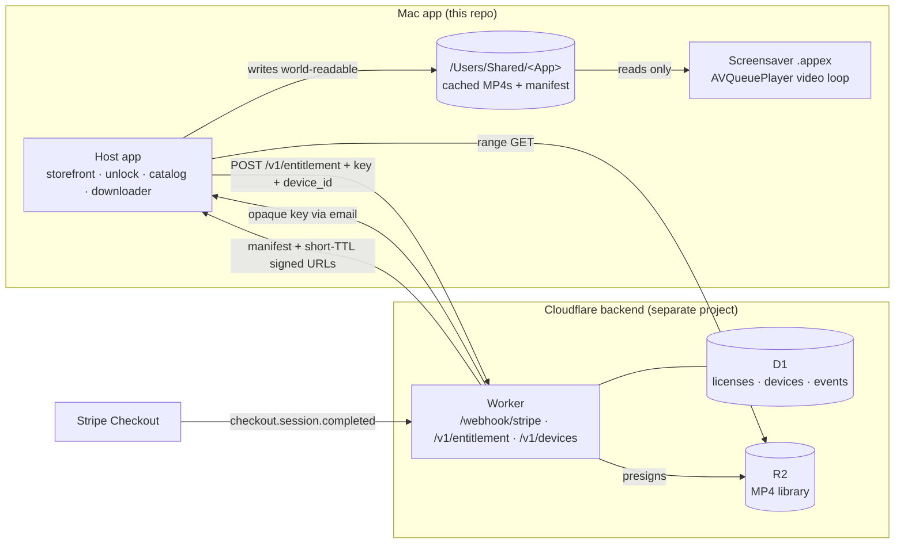

# feat: Surrealism video screensaver — paid direct-sale Mac app + delivery backend

## Summary

Turn the AppexSaverMinimal template into a paid, direct-sale macOS video screensaver that loops surrealist videos from surrealism.tv / surrealism.ai. The host app becomes a storefront, license activator, catalog browser, and downloader; the sandboxed extension swaps its rainbow animation for an `AVQueuePlayer`-backed looping video player reading from a shared local cache. A net-new Cloudflare backend (Workers + D1 + R2) takes Stripe payments, issues opaque license keys, and serves a catalog manifest with short-TTL R2 download URLs only to valid keys. The app installs free with bundled sample loops; a paid unlock downloads the full library.

The plan is phased so the playback path is buildable and viewable against bundled samples and a stubbed manifest before the commerce layer exists — but the genuinely novel risks (sandboxed extension reading the shared cache on a *notarized* build, at the login window; multi-display decode) are validated in a front-loaded spike, not deferred (see origin: `docs/brainstorms/2026-07-05-video-screensaver-requirements.md`).

---

## Problem Frame

The repo today is the unmodified template rainbow screensaver (`AppexSaverMinimal/RainbowAnimator.swift`). Jay produces surrealist video and already hosts it on Cloudflare R2 for surrealism.tv / surrealism.ai, but has no way to bring that library to the Mac screensaver surface or to sell it. The two deliverables — a Mac app and a commerce/delivery backend — are new. Technical risk concentrates in two researched areas: playing video reliably inside a sandboxed screensaver extension, and wiring Stripe → license keys → gated R2 delivery. Both are settled below by mirroring the proven [Aerial](https://github.com/AerialScreensaver/Aerial) screensaver and current Stripe/Cloudflare/Apple guidance.

---

## High-Level Technical Design

Two deliverables, four external services. The screensaver extension never touches the network — it only reads cached files the host app wrote.



**Playback lifecycle (extension).** Drive start/stop from `viewDidMoveToWindow` (`window != nil` → play, `nil` → stop) — the framework's `startAnimation()`/`stopAnimation()` are not reliably called in the `.appex` context. Keep `SSENeedsAnimationTimer = false`; `AVPlayer` renders off its own display link. Backing layer stays black and opaque; the `AVPlayerLayer` starts at opacity 0 and rises to 1 once the first frame is ready, so there is never a white flash.

---

## Requirements

Carried from origin (`docs/brainstorms/2026-07-05-video-screensaver-requirements.md`) and extended with research- and review-driven hardening requirements (R19–R24).

**Playback (extension)**

- R1. The extension plays MP4 loops from the shared local cache, cycling through the viewer's selected videos.
- R2. Playback loops seamlessly and runs muted by default.
- R3. Playback covers all connected displays while the screensaver is active, including at the login window and lock screen.
- R4. When the cache holds no downloaded videos, the extension falls back to the bundled sample loop(s).

**Free tier and activation**

- R5. The app installs and runs free, with 1–2 sample loops bundled in the app so it works immediately and offline with no key.
- R6. The host app installs and activates the screensaver through the existing pluginkit + PaperSaver flow.

**Purchase and unlock**

- R7. The viewer purchases a license on surrealism.tv and receives a license key.
- R8. Entering a valid key unlocks the full library; the backend serves the catalog manifest and signed R2 URLs only to valid keys.
- R9. Unlock state persists across launches so the key is entered only once.

**Library and downloads (host app)**

- R10. After unlock, the host app shows a catalog of the full library with thumbnails.
- R11. The viewer selects which loops to download; selected loops download from R2 into the shared cache.
- R12. The viewer can remove downloaded loops and see how much disk the cache is using.
- R13. Downloads run without blocking the UI and survive interruption (resume or retry rather than corrupt the cache).
- R14. The catalog reflects videos added server-side without requiring an app update.

**Backend (net-new)**

- R15. On a settled Stripe payment, the backend generates a high-entropy opaque license key and delivers it to the buyer by email.
- R16. The backend exposes an endpoint that validates a submitted key and returns the catalog manifest plus signed, time-limited R2 URLs.
- R17. The catalog manifest is editable server-side so new videos appear in the app without a release (supports R14).

**Distribution**

- R18. The app ships as a notarized, code-signed direct download (DMG) from surrealism.tv, not the Mac App Store.

**Delivery hardening (from research + review)**

- R19. Cached media and manifest live only in a non-TCC-protected, world-readable location (`/Users/Shared/<App>`, dir `0755`, files `0644`); the extension never reads from `~/Movies`, `~/Downloads`, `~/Documents`, or Desktop (silent black-screen risk).
- R20. Playback survives display/system sleep-wake without going permanently black.
- R21. Refunds and chargebacks revoke a key server-side; a revoked key receives no new download URLs on its next catalog refresh. (Accepted limit: content already downloaded before revocation is not clawed back — consistent with the no-DRM decision.)
- R22. Activation is capped at a soft device limit (default 5) with a self-service deactivation endpoint — not hard DRM, not unlimited sharing.
- R23. Key generation and email delivery are idempotent across Stripe webhook retries and gate on settled payment (`payment_status === 'paid'`).
- R24. `/v1/entitlement` is rate-limited and treats unknown, malformed, and revoked keys with one uniform denial response (no key-status oracle).

---

## Key Technical Decisions

- **AVQueuePlayer + AVPlayerLayer, not AVSampleBufferDisplayLayer (single-display) — multi-display decode is an open spike.** Matches Aerial for the single-display and mirrored cases. `AVQueuePlayer` is required for `AVPlayerLooper` and for preloading the next clip. No `AVPlayerItemVideoOutput` in the saver — it defeats zero-copy hardware decode and can tone-map HDR. **Caveat (must spike, U3):** mirrored displays share one framebuffer, so "shared decode" is automatic there and buys nothing; for *independent* displays, a single `AVPlayer` backing multiple `AVPlayerLayer`s can leave the second layer black. If the on-hardware spike confirms that, the fallback is one `AVPlayer` per display — validate decode cost of N×4K HEVC on the minimum-target GPU, and only then reconsider `AVSampleBufferDisplayLayer` (the actual tool for fanning one decode to many layers).
- **Lifecycle on `viewDidMoveToWindow`, `SSENeedsAnimationTimer = false`.** `startAnimation()`/`stopAnimation()` are unreliable in the `.appex` host; the existing rainbow sample already uses the correct pattern.
- **Cache in `/Users/Shared/<App>`, not an App Group — reverses the origin's App-Group assumption.** The origin assumed an App Group; research showed that for a notarized direct-sale app, Aerial's `/Users/Shared` + `com.apple.security.temporary-exception.files.absolute-path.read-write` approach is proven, simpler, and avoids App Groups resolving unreliably under the sandboxed screensaver host and the lock-screen user-context path problem. Files must be written **world-readable** (R19) so the login-window context (which runs as a different security context than the host that wrote them) can read them. The temporary-exception entitlement is Apple-deprecated but accepted under Developer ID today; App Group is the documented fallback if MAS eligibility is ever wanted (there the group id must be Team-ID-prefixed and the non-sandboxed host must also declare the entitlement).
- **Multi-clip rotation via observe-end + cross-fade; single clip via `AVPlayerLooper`.** `AVPlayerLooper` is gapless only at rate 1.0 for one repeating clip. For a playlist, observe `.AVPlayerItemDidPlayToEndTime`, swap the item, and mask the black gap with an opacity fade on the `AVPlayerLayer`. Ordering (shuffle/sequential) stays in the loader, not the player.
- **Opaque server-validated license keys, not offline crypto — matches the origin's "server-gated, not local crypto" decision.** The key is a high-entropy opaque token. Unlock is granted after the first successful online `/v1/entitlement` call and persisted locally; there is no client-side signature check. This is deliberate: downloading requires the online call regardless, cached playback does no license check, so an offline signature would guard only the transient "unlock UI while offline" state at the cost of embedded-key management and dual-target crypto. Enforcement lives entirely server-side (D1 status + device cap), which also removes any embedded-private-key mass-forgery blast radius.
- **R2 presigned S3-style URLs, TTL 4h, direct-to-edge download.** The Worker presigns GET URLs after validating the key; bytes flow app↔R2 directly, never through the Worker. TTL defaults to 4h; the app re-fetches the manifest on resume-after-expiry. Range requests (HTTP 206) drive resumable downloads; send `If-Range: <etag>` so a replaced object can't corrupt a resumed file.
- **All-Cloudflare backend: Workers + D1 + R2.** Fewest moving parts — one `wrangler deploy`, no separate DB/object host. D1 holds `licenses`, `devices`, `webhook_events` (idempotency). All secrets set via `wrangler secret put` (never in `wrangler.toml`/source), separate per environment. Stripe Tax collects at checkout; filing/remitting is ours (see Risks — a pre-launch gate, not app behavior).
- **Notarized DMG, signed inner-to-outer, `notarytool` only.** Hardened Runtime (`-o runtime`) on every binary including the appex; sign appex before host; never `--deep`; package with `ditto`; staple the `.app`, then build the DMG. DMG (drag-to-/Applications) not ZIP, to avoid app translocation breaking cache access. Because signing/notarization gate the shared-cache read test, they are set up in Phase 0, not deferred to the end.

---

## Output Structure

New Swift files in this repo (playback engine shared across both targets, following the `RainbowAnimator` dual-membership pattern), plus a separate backend project.

```
AppexSaverMinimal/            (this repo)
├── Shared/
│   ├── VideoPlayerController.swift    # AVQueuePlayer + AVPlayerLayer + rotation/fade/wake  (BOTH targets)
│   ├── VideoCache.swift               # /Users/Shared/<App> path (world-readable) + MP4 enumeration  (BOTH targets)
│   └── CatalogManifest.swift          # Codable manifest model                              (host; ext reads files only)
├── AppexSaverMinimal/
│   ├── LicenseManager.swift           # key entry, entitlement call, unlock persistence
│   ├── CatalogViewModel.swift         # manifest fetch, selection, disk usage
│   ├── DownloadManager.swift          # resumable range downloads → cache
│   ├── Samples/                       # 1-2 bundled sample loops (folder reference in BOTH targets)
│   └── ContentView.swift              # extended: storefront + catalog UI
├── AppexSaverMinimalTests/           # NEW XCTest target (created in U12)
└── (extension view/controller updated to host VideoPlayerController)

surrealism-screensaver-backend/   (separate Cloudflare Workers project — NOT this repo)
├── src/index.ts                  # routes: /webhook/stripe, /v1/entitlement, /v1/devices/deactivate
├── src/stripe.ts  src/licenses.ts  src/manifest.ts  src/r2.ts
├── schema.sql                    # licenses, devices, webhook_events
└── wrangler.toml
```

The tree is a scope declaration, not a constraint; per-unit `**Files:**` are authoritative.

---

## Implementation Units

Grouped into five phases. **Phase 0** retires the project's top technical risk before feature work. Phase A produces a working, viewable screensaver against bundled samples. **Backend units (Phase B) target a separate repo** — `surrealism-screensaver-backend/`; paths within those units are relative to that project root.

### Phase 0 — Prerequisites and risk-retirement spike

### U12. Project bootstrap: test target, signing, and notarized shared-cache read spike

- **Goal:** Create the missing test target, enable signing, and prove the single riskiest assumption — that a notarized, Hardened-Runtime, sandboxed extension can read a world-readable file from `/Users/Shared/<App>` at the login window — before any feature or commerce work stacks on it.
- **Requirements:** supports R3, R19; unblocks all test-bearing units.
- **Dependencies:** none.
- **Files:** `AppexSaverMinimal.xcodeproj/project.pbxproj` (new `AppexSaverMinimalTests` XCTest target with scheme test action and `@testable` host; set `DEVELOPMENT_TEAM` on both targets; automatic signing); `AppexSaverMinimalExtension/AppexSaverMinimalExtension.entitlements` (add `com.apple.security.temporary-exception.files.absolute-path.read-write` for `/Users/Shared/`).
- **Approach:** Wire the XCTest bundle so U1/U2/U8/U9/U10 have somewhere to run. Then, as a manual gate: place an MP4 by hand in `/Users/Shared/<App>/videos` (world-readable), point a throwaway build of the extension at it, produce one signed + notarized + stapled build, and confirm the extension renders it — logged out to the login window and at the lock screen, not just inside a normal session. Green-light Phases A–C only after this passes.
- **Patterns to follow:** Aerial `Shared/Models/AerialPaths.swift`; `CLAUDE.md` notarization notes.
- **Test scenarios:** `Test expectation: none — this unit's output is a runnable test target plus a manual on-device/login-window verification, not unit tests.`
- **Verification:** `spctl -a -vvv -t exec` reports notarized; the manually-placed clip plays under `ScreenSaverEngine`, at the login window, and at the lock screen.

### Phase A — Playback foundation (Mac app, no commerce)

### U1. Shared video player engine

- **Goal:** A reusable `VideoPlayerController` (the primary engine build, not a trivial swap) owning an `AVQueuePlayer` + `AVPlayerLayer`, looping/rotating a playlist with cross-fade, tearing down observers cleanly, and surviving sleep-wake.
- **Requirements:** R1, R2, R20.
- **Dependencies:** U12.
- **Files:** `AppexSaverMinimal/Shared/VideoPlayerController.swift` (new, both-target membership); test `AppexSaverMinimalTests/VideoPlayerControllerTests.swift`.
- **Approach:** Single `AVQueuePlayer` reused for the app's lifetime (never new per clip). Single-clip → `AVPlayerLooper`; multi-clip → observe `.AVPlayerItemDidPlayToEndTime`, build a fresh `AVPlayerItem`, `removeAllItems()`/`insert`, cross-fade opacity via a periodic time observer. Muted by default. On every transition: disable/nil the looper and remove the end observer and periodic observers before arming the next item. Observe `NSWorkspace.didWakeNotification`: if `currentItem == nil` restart, else pause/play nudge; defer advances requested while asleep. Budget a soak-test pass — observer-teardown and memory stability are the historically fiddly part.
- **Patterns to follow:** Aerial `PlayerCoordinator.swift`, `AerialSaverView.swift`; dual-target membership of `RainbowAnimator.swift` (`CLAUDE.md`).
- **Test scenarios:**
  - Single-clip playlist loops without advancing past one item.
  - Multi-clip playlist advances on end-of-item and fires the fade ramp.
  - Transition removes prior observers (no double-fire on a second advance).
  - Wake with `currentItem == nil` restarts; wake with a live item nudges, not restarts.
  - Muted by default; the same `AVQueuePlayer` instance is reused across N transitions.
  - Soak: memory does not grow per transition over a long rotation run.
- **Verification:** 1 vs N URLs produce looping vs rotating playback; memory flat across a soak run.

### U2. Cache storage and permissions

- **Goal:** Resolve and manage the shared cache at `/Users/Shared/<App>` with world-readable permissions; enumerate playable MP4s.
- **Requirements:** R19; supports R1, R4, R11.
- **Dependencies:** U12.
- **Files:** `AppexSaverMinimal/Shared/VideoCache.swift` (new, both targets); test `AppexSaverMinimalTests/VideoCacheTests.swift`.
- **Approach:** Path helper returns `/Users/Shared/<App>` (create dir `0755` if absent), a videos subdir, and a manifest path. Writes create files `0644`. Enumerate `.mp4`/`.mov` deterministically. Never resolve to a TCC-protected dir. Keep the extension's existing CARenderServer/CoreDisplay mach-lookup exceptions.
- **Patterns to follow:** Aerial `Shared/Models/AerialPaths.swift` (`/Users/Shared/Aerial`).
- **Test scenarios:**
  - Path helper creates the directory `0755` when missing and returns a stable path.
  - Written files are mode `0644` (world-readable).
  - Enumeration returns only playable extensions deterministically; empty dir → empty list.
- **Verification:** A world-readable file in `/Users/Shared/<App>/videos` is discovered and read by both host and extension (already proven end-to-end at the login window in U12).

### U3. Extension video integration and multi-display

- **Goal:** Replace the rainbow animation with `VideoPlayerController`, driven from `viewDidMoveToWindow`; fall back to bundled samples when the cache is empty; resolve multi-display behavior on real hardware.
- **Requirements:** R1, R3, R4, R5.
- **Dependencies:** U1, U2.
- **Files:** `AppexSaverMinimalExtension/AppexSaverMinimalView.swift` (rewrite body), `AppexSaverMinimalExtension/AppexSaverMinimalViewController.swift` (isPreview heuristic), `AppexSaverMinimal/Samples/` (bundled loops, folder reference added to **both** targets' Copy Bundle Resources — the saver reads from its own `.appex` bundle). `Test expectation: none for view wiring — behavior covered by U1.`
- **Approach:** Keep `wantsLayer`, black opaque `makeBackingLayer`, `SSENeedsAnimationTimer = false`. Start playback when `window != nil`, stop when nil. Play cache videos if present, else bundled samples from the extension bundle. Multi-display: in `viewDidMoveToWindow` only paint black and arm a ~250 ms fallback `DispatchWorkItem`; run per-display setup on `NSWindow.didChangeScreenNotification` or the fallback, guarded by a `didRunSettledSetup` flag. **Blocking spike (resolves the multi-display Open Question):** on real independent displays, test whether one `AVPlayer` drives two visible `AVPlayerLayer`s; if the second goes black, adopt one `AVPlayer` per display and record measured N×4K decode cost. Default same-clip-synced across displays.
- **Patterns to follow:** existing `AppexSaverMinimalView.swift` lifecycle; Aerial settled-setup, `NSHashTable.weakObjects()`.
- **Test scenarios:**
  - Covers R4, R5. Empty cache → bundled sample plays (validate at the login window on a clean install — the flagship free path).
  - Covers R1. Non-empty cache → cached videos play.
  - Per-display setup does not run before the screen settles (no "both monitors show the main-display playlist").
  - Two independent displays each show video (not a black second monitor) under the chosen decode strategy.
- **Verification:** Screensaver runs with samples on a fresh install (incl. login window) and cached clips after downloads; both monitors show video.

### U4. Host preview parity

- **Goal:** The in-app preview renders identically to the screensaver using its own player instance; lightweight in the small preview frame.
- **Requirements:** R5.
- **Dependencies:** U1, U2.
- **Files:** `AppexSaverMinimal/PreviewView.swift`, `AppexSaverMinimal/PreviewViewRepresentable.swift` (host a `VideoPlayerController`).
- **Approach:** Instantiate a second `VideoPlayerController` (separate process from the extension — never share a live `AVPlayer`). Samples resolve from the host bundle (folder reference is in both targets per U3). In `isPreview`/tiny frame, show a static poster or a single lightweight decode rather than full rotation.
- **Patterns to follow:** existing `PreviewView`; dual-instance approach in KTDs.
- **Test scenarios:** `Test expectation: none — visual parity verified by running the host preview against U1 coverage.`
- **Verification:** Host preview shows the same content the saver would, without heavy multi-clip decode.

### Phase B — Delivery backend (separate Cloudflare project)

### U5. Backend scaffold and license store

- **Goal:** A `wrangler` Worker project with D1 schema, R2 binding, and secrets wired.
- **Requirements:** supports R15, R16, R21, R23.
- **Dependencies:** none (parallelizable with Phase A).
- **Files (in `surrealism-screensaver-backend/`):** `wrangler.toml`, `schema.sql`, `src/index.ts`, `src/licenses.ts`.
- **Approach:** D1 tables `licenses(key_id PK, stripe_session_id, email, status, created_at)`, `devices(key_id, device_id, activated_at)`, `webhook_events(event_id PK)`. Status enum `active | refunded | revoked | disabled`. `key_id` is a high-entropy random token (non-sequential). All secrets via `wrangler secret put`, separate per environment.
- **Test scenarios:** schema migration applies cleanly; license insert + status update round-trips; `webhook_events` insert is unique-constrained.
- **Verification:** `wrangler dev` serves; D1 migrations apply locally and remotely.

### U6. Stripe checkout + webhook fulfillment

- **Goal:** Take payment, mint and email an opaque key idempotently, and handle refunds/chargebacks.
- **Requirements:** R7, R15, R21, R23.
- **Dependencies:** U5.
- **Files:** `surrealism-screensaver-backend/src/stripe.ts`, `src/licenses.ts`, `src/index.ts`.
- **Approach:** Checkout Session (`mode: payment`, Stripe Tax enabled). Webhook verifies signature (`constructEventAsync`), dedupes on `event.id` via `webhook_events`, gates on `payment_status === 'paid'`, handles `async_payment_succeeded/failed`. Generate a high-entropy `key_id`, insert into D1, email via Resend/Postmark (idempotent). Handle `charge.refunded` and `charge.dispute.created` → flip status.
- **Test scenarios:**
  - Duplicate webhook delivery mints exactly one key and sends one email.
  - Invalid webhook signature rejected.
  - `payment_status !== 'paid'` does not issue a key.
  - `charge.refunded` flips the key to `refunded`.
- **Verification:** Stripe CLI test event drives one end-to-end key creation; refund event revokes.

### U7. Entitlement + catalog endpoint

- **Goal:** Validate a key online and return the manifest with short-TTL R2 URLs, enforcing device cap, revocation, and rate limits.
- **Requirements:** R8, R16, R17, R21, R22, R24.
- **Dependencies:** U5, U6.
- **Files:** `surrealism-screensaver-backend/src/index.ts`, `src/manifest.ts`, `src/r2.ts`.
- **Approach:** `POST /v1/entitlement` with `{ license_key, device_id (required), app_version }`. Rate-limit before any DB work — named mechanism (Cloudflare Rate Limiting rule, e.g. 10/min per IP and 60/day per key) returning 429. Look up `key_id`; **unknown, malformed, and non-active keys all return one uniform denial** (no status oracle — R24). Enforce the soft device cap (default 5) keyed on `device_id`; over cap → a distinct "deactivate a device" response. Return manifest: `catalog_version`, per-video `{id, title, bytes, sha256, etag, content_type, url, url_expires_at}` with presigned GET URLs (aws4fetch, TTL 4h). The manifest field set (incl. `etag`, used by U10's `If-Range`) is the versioned contract U8/U10 depend on.
- **Test scenarios:**
  - Covers R8. Valid active key + device_id → manifest with signed URLs incl. `etag`.
  - Revoked/refunded key and unknown/malformed key → identical uniform denial.
  - Missing `device_id` → rejected (cap cannot be silently bypassed).
  - Rate limit exceeded → 429 before any DB lookup.
  - Device cap exceeded → deactivation-required response.
  - Server-side catalog change → new video appears (Covers R14/R17).
- **Verification:** A minted key returns a working, expiring URL; revoked/unknown keys are indistinguishable in the response.

### U13. Device deactivation endpoint

- **Goal:** Let a viewer free a device slot so the soft cap (R22) isn't a dead end.
- **Requirements:** R22.
- **Dependencies:** U5, U7.
- **Files:** `surrealism-screensaver-backend/src/index.ts`, `src/licenses.ts`.
- **Approach:** `POST /v1/devices/deactivate` with `{ license_key, device_id }`. Authorization: possession of the license key plus the target `device_id` is sufficient to remove that key↔device row. Rate-limited like `/v1/entitlement`.
- **Test scenarios:** valid key + owned device_id removes the row and frees a slot; unknown key → uniform denial; deactivating a non-existent pair is a no-op success.
- **Verification:** After deactivation, a capped key can activate a new device.

### Phase C — App ↔ backend integration

### U8. License unlock in host app

- **Goal:** Enter a key, unlock via the online entitlement call, and persist unlock.
- **Requirements:** R7, R8, R9.
- **Dependencies:** U7 (endpoint contract), U2.
- **Files:** `AppexSaverMinimal/LicenseManager.swift` (new), `AppexSaverMinimal/Shared/CatalogManifest.swift` (new Codable model, coding keys matching U7's JSON), `AppexSaverMinimal/ContentView.swift` (unlock UI). Test `AppexSaverMinimalTests/LicenseManagerTests.swift`.
- **Approach:** Generate a random `device_id` once on first launch and persist it locally (not hardware-derived — avoids a cross-app fingerprint). Send `{ key, device_id }` to `/v1/entitlement`; on success, persist unlock and store the manifest. Re-hit periodically; honor a denial by re-locking. No client-side signature check (keys are opaque).
- **Test scenarios:**
  - Covers R8, AE2. Invalid/empty key → stays locked, clear failure.
  - Successful unlock persists across relaunch (R9).
  - A later denial response re-locks.
  - Over-cap response surfaces the deactivation path.
- **Verification:** A real minted key unlocks and fetches the catalog; a bad key does not.

### U9. Catalog browser UI

- **Goal:** Browse the manifest with thumbnails, select videos, remove them, and show disk usage.
- **Requirements:** R10, R12.
- **Dependencies:** U8.
- **Files:** `AppexSaverMinimal/CatalogViewModel.swift` (new), `AppexSaverMinimal/ContentView.swift` (catalog view). Test `AppexSaverMinimalTests/CatalogViewModelTests.swift`.
- **Approach:** Render manifest entries with thumbnails (source per Open Questions), selection state, downloaded/available status, remove action, total cache size. Ordering/selection stay out of the player.
- **Test scenarios:** selection toggles persist; remove deletes the cached file and updates disk usage; downloaded vs available reflects the cache.
- **Verification:** Catalog lists the library, selections drive downloads, removal frees disk.

### U10. Download manager

- **Goal:** Download selected videos resumably into the cache without blocking the UI.
- **Requirements:** R11, R13, R19.
- **Dependencies:** U8, U2.
- **Files:** `AppexSaverMinimal/DownloadManager.swift` (new). Test `AppexSaverMinimalTests/DownloadManagerTests.swift`.
- **Approach:** `URLSession` background download with HTTP `Range` resume; write into `/Users/Shared/<App>/videos` world-readable; verify `sha256`/size from the manifest; send `If-Range: <etag>`; on resume-after-expiry failure, re-fetch the manifest for a fresh URL. Progress reporting; concurrency-limited.
- **Test scenarios:**
  - Covers R13. Interrupted download resumes from offset, not from scratch.
  - Expired URL mid-resume → manifest re-fetch, then success.
  - Integrity mismatch → discard and re-download; never leave a corrupt file in cache.
  - Cancelled download leaves no partial file the extension would try to play.
- **Verification:** A large clip downloads, survives a forced interruption, and plays in the saver.

### Phase D — Packaging, tax, and distribution

### U11. Signing, notarization, tax setup, and DMG

- **Goal:** A reproducible signed + notarized + stapled DMG for direct sale, with tax obligations set up before first sale.
- **Requirements:** R6, R18.
- **Dependencies:** all prior units. (Signing itself was bootstrapped in U12; this unit hardens the release pipeline.)
- **Files:** `scripts/release.sh` (new), `docs/RELEASE.md` (new), both target entitlements finalized.
- **Approach:** Sign inner-to-outer (appex first, then host), Hardened Runtime on every binary, never `--deep`. `ditto`-package, `notarytool submit --wait`, `stapler staple` the `.app`, build the DMG, verify with `spctl`. Document that the user opens the app once so pluginkit registers the saver. **Pre-launch tax gate (blocking for going live):** configure Stripe Tax jurisdictions, register for EU Non-Union OSS (digital goods to EU consumers has effectively a zero threshold — obligation from sale #1) and any US economic-nexus states, and decide remittance cadence — or revisit the merchant-of-record option (Paddle / Lemon Squeezy) if the compliance labor outweighs the fee saving. Note Sparkle as deferred follow-up.
- **Test scenarios:** `Test expectation: none — verified by build/notarize outcomes and a tax-setup checklist, not unit tests.`
- **Verification:** `spctl -a -vvv -t exec` reports `source=Notarized Developer ID`; the DMG installs and the saver appears on a clean machine; tax collection is configured and registrations filed before launch.

---

## Acceptance Examples

- AE1. Covers R4, R5. Fresh free install, no key, no downloads → the screensaver activates and plays a bundled sample loop, including at the login window.
- AE2. Covers R8. Invalid or empty license key submitted → library stays locked, failure shown clearly.
- AE3. Covers R1, R4. Unlocked but no catalog videos cached yet → bundled samples play until at least one selected video finishes downloading.
- AE4. Covers R1. Selected videos already cached, machine offline → playback proceeds normally from cache.
- AE5. Covers R21. Key refunded server-side → next catalog refresh returns no download URLs (already-downloaded clips remain — accepted).
- AE6. Covers R19, R20, R24. Media only ever read from world-readable `/Users/Shared/<App>`; saver recovers (not permanently black) after display sleep-wake; unknown and revoked keys are indistinguishable in the entitlement response.

---

## Scope Boundaries

**Deferred for later** (from origin — eventually, not v1)

- Themed paid "packs" and upsells beyond the base unlock.
- Auto-download-all mode as an alternative to the catalog picker.
- Free-trial timers or time-limited unlocks.

**Outside this product's identity** (from origin — positioning)

- Live streaming / on-the-fly network playback in the screensaver.
- Mac App Store distribution.
- Hard DRM or at-rest encryption of cached videos.

**Deferred to follow-up work** (plan-local sequencing)

- Sparkle 2 (EdDSA) auto-update. Compatible and standard for direct-sale, but v1 ships without it; the manifest already refreshes the video library without app updates. When added: sign Sparkle's XPC services individually, EdDSA-sign the appcast, and verify pluginkit re-registers the updated appex after a self-update.

---

## Risks & Dependencies

- **Media in a TCC-protected directory → silent black screen.** The screensaver cannot present a consent prompt; a read in `~/Movies`/`~/Downloads`/`~/Documents`/Desktop fails silently. Mitigation: R19, enforced in `VideoCache`.
- **Login-window / lock-screen read failure.** The saver runs in a different security context than the host that wrote the files; non-world-readable files fail silently there. Mitigation: world-readable perms (R19) + explicit login-window verification in U12/U3.
- **Multi-display shared decode may not work.** One `AVPlayer` on independent displays can black the second layer; the plan rejects the two APIs that fan one decode to many layers. Mitigation: blocking on-hardware spike in U3; fall back to per-display `AVPlayer` with measured decode cost, or reopen `AVSampleBufferDisplayLayer`.
- **AVPlayer memory creep + black-on-wake over long runs.** Mitigation: single reused `AVQueuePlayer`, strict observer teardown, wake-nudge, soak test (U1).
- **Presigned URL expiry checked at request start only.** A resumed range request after expiry fails. Mitigation: 4h TTL + manifest re-fetch on resume failure (U10).
- **Stripe webhook duplication / async settlement.** Mitigation: idempotency on `event.id`, gate on `payment_status` (U6, R23).
- **Entitlement endpoint as a key oracle / brute force.** Mitigation: rate-limit before DB work + uniform denial for unknown/revoked keys + high-entropy non-sequential key_id (R24, U7).
- **Notarization rejects on any unsigned embedded binary.** Every binary including the appex needs Developer ID + Hardened Runtime; `notarytool log` names the offender. Mitigation: inner-to-outer signing, retired early in U12.
- **App translocation breaks cache access.** Distribute via DMG (drag-to-/Applications), not run-in-place ZIP (U11, KTD).
- **Tax/VAT liability is ours from sale #1** with raw Stripe (EU VAT on digital goods has effectively no threshold). Stripe Tax collects but does not register/file/remit. Mitigation: pre-launch tax gate in U11, or reconsider a merchant-of-record.
- **`temporary-exception` entitlement is Apple-deprecated.** Accepted under Developer ID today; a future-maintenance risk if Apple removes it — App Group is the documented fallback.
- **Dependency — Apple Developer team.** `DEVELOPMENT_TEAM` is empty in `AppexSaverMinimal.xcodeproj`; set in U12 (signing, notarization, any App Group id all require it).
- **Dependency — no test target today.** `AppexSaverMinimalTests` does not exist; created in U12 before any test-bearing unit.

---

## Open Questions (deferred to implementation)

- Thumbnail source for the catalog: generated from the video first frame vs. provided in the manifest.
- Download concurrency limit (tune against real file sizes; TTL is fixed at 4h).
- Local unlock-state persistence mechanism and where `device_id` is stored.
- Backend detail: KV revocation cache vs D1-only; email provider (Resend vs Postmark).

(Resolved during review: multi-display default is now a blocking spike in U3; presigned TTL fixed at 4h; `device_id` is a locally-persisted random UUID, required; licensing is server-validated opaque keys, not offline crypto.)

---

## Sources / Research

- Aerial screensaver source (playback reference): `AerialScreenSaverExtension/AerialSaverView.swift`, `PlayerCoordinator.swift`, `AerialScreenSaverExtension.entitlements`, `Shared/Models/AerialPaths.swift` — https://github.com/AerialScreensaver/Aerial
- AVFoundation: [AVPlayerLooper](https://developer.apple.com/documentation/avfoundation/avplayerlooper) (gapless only at rate 1.0), [AVPlayerLayer](https://developer.apple.com/documentation/avfoundation/avplayerlayer); macOS App Sandbox file access.
- Stripe: [Checkout fulfillment](https://docs.stripe.com/checkout/fulfillment), [webhooks](https://docs.stripe.com/webhooks), [Stripe Tax](https://stripe.com/tax) (collects, does not remit).
- Cloudflare: [R2 presigned URLs](https://developers.cloudflare.com/r2/api/s3/presigned-urls/), [R2 downloads/range](https://developers.cloudflare.com/r2/objects/download-objects/), Workers + D1.
- Apple: [Notarizing macOS software](https://developer.apple.com/documentation/security/notarizing-macos-software-before-distribution) (`notarytool`; `altool` retired Nov 2023); [App Groups entitlement](https://developer.apple.com/documentation/bundleresources/entitlements/com.apple.security.application-groups).
- Local starting points: `AppexSaverMinimalExtension/AppexSaverMinimalView.swift`, `AppexSaverMinimalExtension/AppexSaverMinimalExtension.entitlements`, `AppexSaverMinimal/PreviewView.swift`, `AppexSaverMinimal/RainbowAnimator.swift` (dual-membership pattern), `CLAUDE.md`.
