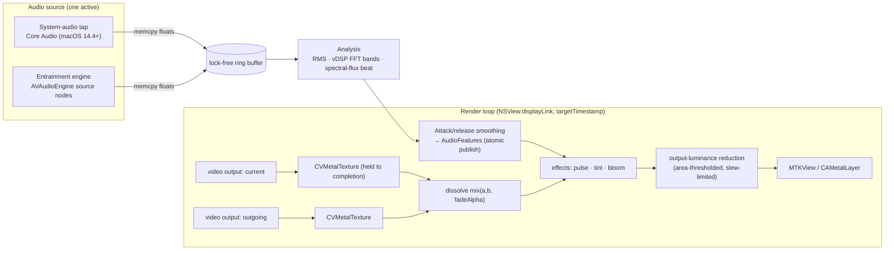

# feat: Visualizer mode — audio-reactive fullscreen/windowed player (v1)

## Summary

Add a second mode to the Surrealism host app: an audio-reactive visualizer that
plays the loop library and reacts to either **system audio** (what's playing on
the Mac) or **app-generated entrainment audio** (binaural/isochronic tones,
noise). Video frames are pushed through a **Metal shader pipeline** so beat/energy
drive real bloom, pulse, and tint at 60fps. Named session presets are the primary
control; a breathing pacer and focus-point mode ship alongside. All flashing is
bounded by measuring the **composited output** luminance against WCAG 2.3.1, with
a safe-mode default. The screensaver extension is untouched *in behavior*, but the
shared playback engine is refactored to be presentation-agnostic (U11). Roadmap
state-change techniques are out of scope (see origin:
`docs/brainstorms/2026-07-05-visualizer-mode-requirements.md`).

> Deepened 2026-07-05 (multi-agent doc review). Six load-bearing corrections were
> applied: the cross-fade is the presentation (U11 + two-texture U4), safety must
> measure the output framebuffer (U6), the real-time thread must not allocate
> (U1–U3), `NSView.displayLink` needs a weak-proxy target, tap denial is silence
> not a callback (U3 health probe), and the deployment target is resolved to 14.4
> (taps-only). Loops were verified **Rec.709 8-bit SDR ~24fps**, so HDR deferral
> is safe.

---

## Problem Frame

Surrealism ships a passive screensaver. Surrealism Today is "visuals for music
experiences," so an active, on-demand music visualizer from the same loops is
on-brand and adds real value. The playback engine
(`AppexSaverMinimal/VideoPlayerController.swift`) already loops and cross-fades,
but its cross-fade **is** its presentation: two `AVQueuePlayer`s each with its own
`AVPlayerLayer`, blended by layer opacity. It cannot be shader-filtered, and the
transition can't be reproduced by sampling a single video texture. The new work is
the macOS media/DSP stack around it — a presentation-agnostic refactor,
system-audio capture, real-time analysis, a two-texture Metal compositor,
entrainment synthesis — and, non-negotiably, output-measured seizure safety.

---

## High-Level Technical Design

One source-agnostic signal pipeline feeds a Metal effect pipeline. Capture and
entrainment both write raw float samples to one lock-free ring buffer; downstream
is identical. Two video textures (current + outgoing during a transition) are
blended by the cross-fade alpha, then effects apply, then **output luminance is
measured and slew-limited** before display.



**Render clock.** `NSView.displayLink(target:selector:)` (macOS 14; `CVDisplayLink`
is deprecated) drives the loop via a **weak-proxy target** — the link retains its
target, so a strong self-reference leaks the whole render loop + audio engine +
Metal resources on every visualizer enter/exit; invalidate explicitly on teardown.
Each tick uses the link's **`targetTimestamp`** (not "now") for
`videoOutput.itemTime(forHostTime:)`, else frames judder by ~one refresh.

**Threading.** Analysis runs on the main-thread display-link cadence (a 1024-pt
vDSP FFT is cheap); `AudioFeatures` is published to the render read via an atomic
snapshot so there are no torn reads. The audio capture/render blocks do zero work
beyond a `memcpy` into the ring buffer.

---

## Requirements

Carried from origin (`docs/brainstorms/2026-07-05-visualizer-mode-requirements.md`),
with one refinement: **R6 uses Core Audio process taps** (the origin assumed
ScreenCaptureKit; see KTD — this is a material change from the origin).

**Playback & effects**

- R1. A fullscreen and a windowed player render the loop library, reusing the refactored playback logic (U11).
- R2. Audio is analyzed in real time for energy, beat/onset, and low/mid/high bands.
- R3. Audio drives effects over the video: energy pulse/zoom, bloom on peaks, band-mapped tint, and transition intensity; loop switching can beat-sync. Transitions cross-fade two decoded streams (budget the double-decode against R5).
- R4. Effects settle to calm ambient playback when audio is quiet.
- R5. Rendering holds ~60fps with effects on, including the worst-case transition frame (two streams + bloom).

**Audio sources**

- R6. External mode captures system audio via a **Core Audio process tap** (macOS 14.4+), requesting audio-capture permission with a clear explanation and a capture-health probe; it degrades to entrainment when capture is denied or not delivering.
- R7. Generated mode plays app-synthesized entrainment audio — binaural/isochronic tones + optional pink/brown-noise bed — driving visuals from that signal via the same analysis path.

**Presets & modes**

- R8. Named presets are the primary control, each bundling an audio behavior + a visual behavior. Launch set: "React to my music," "Sleep (delta)," "Deep calm (theta)," "Calm-alert (alpha)," "Focus (low beta)," "Breathe."
- R9. A single intensity/sensitivity control adjusts the active preset.
- R10. A breathing-pacer visual (expand/contract) with adjustable inhale:hold:exhale, defaulting to ~6 breaths/min, syncable with a pacer tone.
- R11. A focus-point ("Trataka") mode: a single steady symbol or loop held for a fixed duration.

**Safety & framing (must-have)**

- R12. A photosensitivity/seizure gate enforced on the **composited output framebuffer** (area-thresholded luminance, WCAG 2.3.1): safe-mode luminance breathing is the default; strobe is off unless explicitly enabled behind an acknowledged warning; bloom intensity, beat-zoom rate, and loop-switch luminance steps are all bounded.
- R13. Copy frames all effects as non-medical and individually variable; no therapy claims; safety described as "structurally bounded," not "impossible."

**Controls & UX**

- R14. A "Visualizer" entry point in the host app; auto-hiding controls (play/pause, next, preset, intensity, source, windowed/fullscreen, Esc).
- R15. The user picks which display it fills (safety caps are expressed per-second, so they hold on 120Hz/ProMotion displays).

---

## Key Technical Decisions

- **Compositing: `AVPlayerItemVideoOutput` → `CVMetalTextureCache` → `MTKView` with fragment shaders — with TWO video outputs.** The existing cross-fade plays two clips at once and blends them by `AVPlayerLayer` opacity, so the cross-fade *is* the presentation. The Metal path must attach an `AVPlayerItemVideoOutput` to **both** active players and dissolve the two textures in-shader by the fade alpha. A single-texture quad can only hard-cut and would drop the cross-fade. Overlay-CALayer can't sample pixels (no bloom/tint); Core Image is too costly per-frame. Hold each `CVMetalTexture`+`CVPixelBuffer` until the command buffer completes (else the pool recycles under the GPU → tearing); `CVMetalTextureCacheFlush` per frame. Load-bearing decision.
- **Refactor the playback engine to be presentation-agnostic (U11) — the screensaver's behavior is preserved, its shared file is not "untouched."** Extract playlist/looping/rotation/fade-alpha state out of `VideoPlayerController` (a dual-target shared file — see `CLAUDE.md`) into a presentation-agnostic type with two adapters: the existing dual-`AVPlayerLayer` one (screensaver, regression-gated by plan 001 tests) and the Metal one (visualizer).
- **System audio via Core Audio process taps only; minimum macOS bumped to 14.4.** Taps are audio-only (no phantom video), lower overhead, and the "capture what's playing" tool. Dropping the ScreenCaptureKit fallback removes a second capture backend, a second (Screen-Recording) permission model, and the 14.0–14.3 test matrix. The IO proc does **only a `memcpy`** of raw floats from the `AudioBufferList` into the preallocated ring buffer — no `AVAudioPCMBuffer`/format work on the real-time thread. Symmetric teardown (`AudioDeviceStop` → destroy IOProcID → destroy aggregate device → destroy tap) on exit and `deinit`.
- **Capture health is probed, not assumed.** A denied/ungranted tap delivers *silence*, indistinguishable from "music paused," and grants often need a relaunch. So: after installing the tap, if buffers are all-zero for N seconds while the system reports active output audio, surface a distinct "grant audio capture & relaunch" state — separate from "denied" and "quiet" — and fall back to entrainment; never gate the fallback on a denial callback that taps don't emit.
- **Source-agnostic signal pipeline.** Both sources `memcpy` raw floats into one lock-free ring buffer; analysis (RMS via `vDSP_rmsqv`, Hann-windowed 1024-pt `vDSP` FFT with band edges derived from the *active source's* sample rate, spectral-flux beat with rolling mean+std and a ~150ms refractory) runs on the display-link cadence; attack/release smoothing feeds effects.
- **Entrainment via `AVAudioEngine` source nodes, built first** (permission-free signal that validates the analysis path). Generators run in the real-time render block with **atomic, per-sample-ramped** parameter updates (a plain `var` read from the render thread is a data race and clicks on preset/intensity changes). `installTap` `memcpy`s into the ring buffer, with symmetric teardown.
- **Safety measures the composited output, not the input uniform.** A GPU luminance reduction of the final framebuffer feeds an area-thresholded WCAG check; bloom intensity, beat-zoom rate, master brightness/tint, and loop-switch luminance steps are the limited quantities. Caps are expressed **per second** using the display link's real frame interval (so 120Hz displays don't double the allowed rate) over a rolling 1-second window. Safe mode is default; `ReduceMotion` forces it; strobe is opt-in behind a persisted warning and still bounded. Described as "structurally bounded," not "physically impossible."
- **Color: loops are Rec.709 8-bit SDR (verified).** HDR/EDR is safely deferred. But the Metal path must still apply the correct **Rec.709 YUV→RGB matrix** and linearize (sRGB/BT.709 transfer) before linear-space tint/bloom, then re-encode — request color-managed BGRA output or bind an sRGB-format texture so the sampler linearizes, and match the `AVPlayerLayer` reference. Wide-gamut (P3) management is **required if a future non-Rec.709 loop batch ships** (distinct from HDR dynamic range).
- **`NSView.displayLink` (macOS 14), weak-proxy target, explicit invalidation.** Not `CVDisplayLink`. Prevents the render-loop retain-cycle leak and retargets across displays/fullscreen.

---

## Output Structure

New files under a `Visualizer/` group in the host app target (the extension is untouched). `PlaybackSession.swift` is the presentation-agnostic extraction (U11), shared with the screensaver.

```
AppexSaverMinimal/
├── PlaybackSession.swift            # (U11) presentation-agnostic playlist/looping/fade-alpha state (BOTH targets)
└── Visualizer/
    ├── AudioRingBuffer.swift        # lock-free SPSC ring buffer (raw floats)
    ├── AudioAnalyzer.swift          # RMS + vDSP FFT bands + spectral-flux beat + smoothing → AudioFeatures
    ├── EntrainmentEngine.swift      # AVAudioEngine source nodes + atomic param updates + tap + teardown
    ├── SystemAudioCapture.swift     # Core Audio process tap + memcpy IO proc + health probe + teardown
    ├── VisualizerRenderer.swift     # two AVPlayerItemVideoOutputs → CVMetalTextureCache → MTKView + display link
    ├── Effects.metal                # sample two textures + dissolve + pulse/tint + separable-Gaussian bloom
    ├── OutputSafety.swift           # GPU output-luminance reduction + WCAG slew limiting
    ├── VisualizerPreset.swift       # preset model
    ├── BreathingFocusModes.swift    # breathing pacer + focus-point
    ├── VisualizerWindow.swift       # NSWindow fullscreen/windowed, display pick, auto-hide controls
    └── VisualizerView.swift         # host of the renderer + controls
```

---

## Implementation Units

Grouped into phases. Feature-bearing tests use `AppexSaverMinimalTests` **and the signing/`DEVELOPMENT_TEAM` setup** from the screensaver plan (`docs/plans/2026-07-05-001-feat-video-screensaver-plan.md`, U12) — a hard prerequisite: TCC audio-capture grants are keyed to a stable code-signing identity (`DEVELOPMENT_TEAM` is empty today), so U3 needs a real team set.

### Phase A — Signal & analysis (build first; guaranteed source)

### U1. Real-time audio analysis engine

- **Goal:** Turn raw float samples into a smoothed `AudioFeatures` stream (energy, low/mid/high bands, beat flag), sample-rate-aware.
- **Requirements:** R2, R4.
- **Dependencies:** none.
- **Files:** `AppexSaverMinimal/Visualizer/AudioRingBuffer.swift`, `AppexSaverMinimal/Visualizer/AudioAnalyzer.swift`; test `AppexSaverMinimalTests/AudioAnalyzerTests.swift`.
- **Approach:** SPSC lock-free ring buffer of raw floats (power-of-two). Analyzer runs on the display-link cadence: mono downmix, `vDSP_rmsqv`, Hann-windowed 1024-pt `vDSP` FFT (long-lived setup), band magnitudes with **bin ranges derived from the active source's sample rate** (rebuild only on rate change), spectral-flux onset (rolling mean+std, k≈2, ~150ms refractory), per-band rolling-max AGC. Attack/release envelope on every output; publish `AudioFeatures` via an atomic snapshot for the render read.
- **Patterns to follow:** Accelerate/`vDSP` FFT idioms; keep all setup objects long-lived.
- **Test scenarios:**
  - Sine at a known frequency lands energy in the expected band at both 44.1k and 48k sample rates.
  - Silence → energy decays via the release envelope (Covers R4).
  - A step onset raises flux above threshold once; a sustained tone does not re-trigger within the refractory window.
  - Ring buffer under producer-faster-than-consumer drops oldest without tearing.
- **Verification:** Synthetic buffers yield stable, smoothed, sample-rate-correct features at display cadence with no per-frame allocation.

### U2. Entrainment audio engine

- **Goal:** Generate binaural/isochronic tones + noise and feed the analyzer — the always-available signal.
- **Requirements:** R7.
- **Dependencies:** U1.
- **Files:** `AppexSaverMinimal/Visualizer/EntrainmentEngine.swift`; test `AppexSaverMinimalTests/EntrainmentEngineTests.swift`.
- **Approach:** `AVAudioEngine` → `AVAudioSourceNode`(s) → mixer → output. Binaural (two panned sines, double-precision phase), isochronic (raised-cosine-gated carrier), pink (Voss-McCartney/Kellet) + brown (leaky-integrated) noise. Render block is real-time: no allocation/locks; carrier/rate/amplitude cross from the UI via **atomic snapshot + per-sample one-pole ramp** (no zipper clicks). `installTap` `memcpy`s into U1's ring buffer. Symmetric teardown (`removeTap`, `engine.stop()`) on exit and `deinit`.
- **Patterns to follow:** `AVAudioSourceNodeRenderBlock` real-time discipline.
- **Test scenarios:**
  - 200/210 Hz binaural pair produces the expected L/R spectra.
  - Isochronic gate ramps without clicks at the target rate.
  - An intensity change mid-render ramps smoothly (no discontinuity).
  - `Test expectation:` render-block allocation-freedom verified by an allocation-tripwire soak, not a unit test.
- **Verification:** Selecting an entrainment preset drives features with no glitches; parameter changes are click-free.

### Phase B — System-audio capture

### U3. System-audio capture (Core Audio tap)

- **Goal:** Capture what's playing and feed the analyzer, with honest permission handling.
- **Requirements:** R6.
- **Dependencies:** U1.
- **Files:** `AppexSaverMinimal/Visualizer/SystemAudioCapture.swift`; `AppexSaverMinimal/Info.plist` (add `NSAudioCaptureUsageDescription`; confirm whether hardened runtime needs `com.apple.security.device.audio-input`); test `AppexSaverMinimalTests/SystemAudioCaptureTests.swift`.
- **Approach:** `CATapDescription` (system mixdown, `.unmuted`, private) → private aggregate device → `AudioDeviceCreateIOProcIDWithBlock`. The IO proc **only `memcpy`s** raw floats from the `AudioBufferList` into U1's ring buffer (all `AVAudioFormat`/ASBD handling on the consumer side). Read the device ASBD; never hardcode. **Capture-health probe:** all-zero for N seconds while the system reports active output → distinct "grant audio capture & relaunch" state (deep-link to Settings) and fall back to entrainment; treat post-grant as needs-relaunch. Symmetric teardown of tap/aggregate/IOProc on exit and `deinit`.
- **Patterns to follow:** `insidegui/AudioCap`.
- **Test scenarios:**
  - IO proc path does no allocation (tripwire soak).
  - All-zero-while-audio-active probe fires the relaunch state and falls back to entrainment (no dead UI).
  - Enter/exit N times leaves no residual aggregate devices or IOProcs (soak).
  - `Test expectation:` live capture verified on-device (TCC grant + relaunch); unit tests cover the probe + teardown logic.
- **Verification:** Music playing + granted → features track it; denied/undelivered → entrainment drives visuals, with a clear relaunch prompt.

### Phase C — Presentation refactor, Metal compositing & effects (the crux)

### U11. Presentation-agnostic playback session

- **Goal:** Extract playlist/looping/rotation/fade-alpha out of `VideoPlayerController` so both the screensaver (`AVPlayerLayer`) and the visualizer (Metal) drive it.
- **Requirements:** supports R1, R3.
- **Dependencies:** none (do before U4).
- **Files:** `AppexSaverMinimal/PlaybackSession.swift` (new, BOTH targets), `AppexSaverMinimal/VideoPlayerController.swift` (refactor to consume it); test `AppexSaverMinimalTests/PlaybackSessionTests.swift`.
- **Approach:** A presentation-agnostic type owning the two `AVQueuePlayer` slots, rotation, single-clip `AVPlayerLooper` case, and the current cross-fade schedule — vending "current item + optional outgoing item + fade alpha." The screensaver keeps its dual-`AVPlayerLayer` adapter (behavior unchanged, gated by plan 001's `VideoPlayerControllerTests`); the visualizer adds a Metal adapter (U4). This edits a **dual-target shared file** (`CLAUDE.md` warns this is the top parity-break vector) — regression-gate on the screensaver tests.
- **Test scenarios:**
  - Single-clip and multi-clip playlists expose the correct current/outgoing/fade-alpha over a transition.
  - The screensaver's existing playback tests still pass (behavior preserved).
- **Verification:** The screensaver renders identically; the session exposes both streams during a cross-fade.

### U4. Metal video pipeline (two textures)

- **Goal:** Present the looping/cross-fading video through Metal at 60fps.
- **Requirements:** R1, R3, R5.
- **Dependencies:** U11.
- **Files:** `AppexSaverMinimal/Visualizer/VisualizerRenderer.swift`, `AppexSaverMinimal/Visualizer/Effects.metal` (dissolve+passthrough first); test `AppexSaverMinimalTests/VisualizerRendererTests.swift`.
- **Approach:** Attach an `AVPlayerItemVideoOutput` to **both** slot players (attach to items up front so an `AVPlayerLooper` swap doesn't churn re-attach); `NSView.displayLink` (weak-proxy target, explicit invalidate) render loop pulls both buffers for `itemTime(forHostTime:)` derived from the link's **`targetTimestamp`**, reuses last frame when none is new, wraps via a long-lived `CVMetalTextureCache`, and shader-dissolves the two textures by the session's fade alpha. **Hold each `CVMetalTexture`+`CVPixelBuffer` until command-buffer completion; `CVMetalTextureCacheFlush` per frame.** Apply the Rec.709 YUV→RGB matrix + linearize (color-managed BGRA or sRGB-format texture). Budget two decodes during transitions against R5.
- **Patterns to follow:** `PlaybackSession` (U11); Apple `AVPlayerItemVideoOutput` + Metal texture-cache idioms.
- **Test scenarios:**
  - Passthrough (single stream) matches the `AVPlayerLayer` reference in **geometry and color** (Rec.709).
  - A multi-clip transition dissolves both streams (no hard cut / black seam).
  - Frame reuse: a 24fps loop still redraws at display cadence.
  - `Test expectation:` visual/perf verified on-device (incl. the transition frame at 4K); unit tests cover texture-cache lifecycle + dual-output attach.
- **Verification:** The visualizer shows loops (and cross-fades) via Metal at refresh with correct color and no seams.

### U5. Audio-reactive effects

- **Goal:** Drive pulse/zoom, tint, and bloom from `AudioFeatures` in-shader, routed through the safety buffer.
- **Requirements:** R3, R4.
- **Dependencies:** U1, U4.
- **Files:** `AppexSaverMinimal/Visualizer/Effects.metal`, `AppexSaverMinimal/Visualizer/VisualizerRenderer.swift`; test `AppexSaverMinimalTests/EffectsUniformsTests.swift`.
- **Approach:** Triple-buffered uniforms with a `DispatchSemaphore(value: 3)` (wait at frame start, signal in the completion handler) so the CPU never overwrites a buffer the GPU is reading. Shaders: UV scale/zoom from bass + beat envelope; hue/tint/sat from mid/high **in linear light**; separable-Gaussian bloom (threshold→downsample→H/V blur→additive) via a texture pool. **All feature→uniform values pass through the safety limiter (U6), introduced here with identity limits**, so no build ever bypasses it. Quiet → uniforms settle to identity.
- **Patterns to follow:** standard separable-bloom multi-pass structure.
- **Test scenarios:**
  - Covers R3. Rising energy increases pulse/bloom uniforms monotonically (up to caps).
  - Covers R4. Silence → uniforms converge to neutral.
  - Beat flag produces a single decaying zoom envelope, not a sustained hold.
  - Uniforms only ever reach the shader via the limiter sink (no direct path).
- **Verification:** With music the loops pulse/bloom/tint on the beat; silence looks calm; all via the limiter.

### Phase D — Safety

### U6. Output-measured photosensitivity safety

- **Goal:** Make WCAG-violating flashing structurally impossible by bounding the **composited output**; default to safe mode.
- **Requirements:** R12, R13.
- **Dependencies:** U5.
- **Files:** `AppexSaverMinimal/Visualizer/OutputSafety.swift`, `AppexSaverMinimal/Visualizer/VisualizerRenderer.swift`; test `AppexSaverMinimalTests/OutputSafetyTests.swift`.
- **Approach:** A GPU luminance reduction (downsample/mip) of the **final composited framebuffer** each frame feeds an **area-thresholded** WCAG 2.3.1 check (largest contiguous flashing region, not full-field mean). The safety-limited quantities are bloom intensity, beat-zoom rate, master brightness/tint, and **loop-switch/crossfade luminance steps**. Limits are expressed **per second** using the display link's actual frame interval over a rolling 1-second window (holds at 120Hz). Cap opposing transitions ≤3/sec and per-second luminance-swing; clamp tint away from saturated red at high energy. Safe mode default; strobe opt-in behind a persisted acknowledged warning (still bounded); `ReduceMotion` forces safe mode. Prefer bounded spatial motion but treat fast beat-zoom as a limited quantity (not assumed safe).
- **Patterns to follow:** WCAG 2.3.1 flash thresholds; GPU histogram/parallel-reduction idioms.
- **Test scenarios:**
  - Covers R12. A pathological 15Hz on/off *input* is limited to ≤3 output transitions/sec **measured on the framebuffer**.
  - A bright-loop→dark-loop content cut on a beat is rate-limited (content path, not just uniforms).
  - An additive-bloom peak does not push framebuffer luminance past the per-second cap.
  - Same caps hold at a simulated 120Hz frame interval.
  - Reduce-Motion on → safe mode forced; strobe requires the persisted acknowledgment.
- **Verification:** No track/preset/display produces framebuffer flashing beyond the WCAG bound; content cuts and bloom are included in the measurement.

### Phase E — Presets & guided modes

### U7. Preset system + intensity

- **Goal:** Named presets bundling audio source + behavior + visual params, with one intensity control.
- **Requirements:** R8, R9.
- **Dependencies:** U2, U3, U5.
- **Files:** `AppexSaverMinimal/Visualizer/VisualizerPreset.swift`, `AppexSaverMinimal/Visualizer/VisualizerView.swift`; test `AppexSaverMinimalTests/VisualizerPresetTests.swift`.
- **Approach:** A preset selects the audio source (capture vs entrainment band) and target effect ranges. Launch set per R8. Intensity scales the active preset's ranges (within safety caps).
- **Test scenarios:**
  - An entrainment preset starts U2 at the right band; "React to my music" starts U3.
  - Intensity scales ranges but never past the safety caps.
  - Switching presets transitions cleanly (no audio/render glitch).
- **Verification:** Each launch preset produces its intended audio + visual behavior.

### U8. Breathing pacer + focus-point modes

- **Goal:** A resonance breathing pacer and a Trataka focus-point mode.
- **Requirements:** R10, R11.
- **Dependencies:** U4, U2.
- **Files:** `AppexSaverMinimal/Visualizer/BreathingFocusModes.swift`; test `AppexSaverMinimalTests/BreathingFocusTests.swift`.
- **Approach:** Breathing = expand/contract overlay at ~6 bpm default, adjustable ratio, optionally synced to a pacer tone from U2; the loop may gently breathe with it. Focus-point = a single steady symbol/paused loop for a fixed duration.
- **Test scenarios:**
  - Pacer timing matches the configured ratio and rate.
  - Focus mode holds steady for the set duration then ends.
  - `Test expectation:` visual verified by running; unit tests cover the pacer timing model.
- **Verification:** Breathe preset guides breathing; focus mode holds steady.

### Phase F — Window, controls, entry point

### U9. Visualizer window & controls

- **Goal:** Fullscreen + windowed presentation, display choice, auto-hiding controls.
- **Requirements:** R1, R14, R15.
- **Dependencies:** U4.
- **Files:** `AppexSaverMinimal/Visualizer/VisualizerWindow.swift`, `AppexSaverMinimal/Visualizer/VisualizerView.swift`.
- **Approach:** `NSWindow` true fullscreen (`.fullScreenPrimary`) + windowed with an always-on-top option (`.floating` / non-activating `NSPanel`). Choose display by positioning on the target `NSScreen` before fullscreen. Auto-hide cursor + fade transport controls after idle. Idle-sleep assertion while playing; released on stop.
- **Test scenarios:** `Test expectation: none — window behavior verified by running (fullscreen on chosen display, controls auto-hide, Esc exits, no display-sleep while playing).`
- **Verification:** Launches fullscreen on the chosen display; controls hide/show; windowed + always-on-top work.

### U10. Host-app entry point + framing copy

- **Goal:** A "Visualizer" entry in the app, wired to the shared library, with honest copy.
- **Requirements:** R13, R14.
- **Dependencies:** U7, U9.
- **Files:** `AppexSaverMinimal/ContentView.swift`.
- **Approach:** Add a "Visualizer" action opening the mode with the shared loop cache. Copy frames entrainment/flicker as non-medical and individually variable — no therapy claims; safety described as "structurally bounded." Visualizer is un-gated (paywall deferred).
- **Test scenarios:** `Test expectation: none for wiring — behavior covered by U7/U9; copy reviewed for non-medical framing and no "impossible/cure" claims.`
- **Verification:** The app launches the visualizer with the current library; copy carries no medical or absolute-safety claims.

---

## Acceptance Examples

- AE1. Covers R6, R7. Permission granted + music → loops react; denied or not-delivering → entrainment drives visuals with a clear "grant & relaunch" prompt (no dead UI).
- AE2. Covers R4. Audio goes silent → effects settle to calm drift within the release envelope.
- AE3. Covers R12. Across any track/preset/display, **measured framebuffer luminance** (area-thresholded) — including a bright→dark loop cut and an additive-bloom peak — stays ≤3 transitions/sec and under the per-second swing cap; Reduce-Motion forces safe mode; the cap holds at 120Hz.
- AE4. Covers R5, R1. Fullscreen 4K holds ~60fps with bloom on, including the two-stream transition frame; windowed always-on-top stays above other apps.
- AE5. Covers R8. "Focus (low beta)" starts entrainment at the low-beta band with matching visuals; "React to my music" switches to capture.
- AE6. Covers R6, R7. Entering and exiting the visualizer N times leaves no leaked aggregate audio devices, IOProcs, engine taps, or display links.

---

## Scope Boundaries

**Deferred to follow-up work** (plan-local sequencing)

- HDR/EDR dynamic-range pipeline — v1 loops are verified Rec.709 SDR, so SDR is correct; EDR deferred.
- Microphone / "let the user choose" audio source — system audio only in v1.
- Preset editing / per-effect tuning beyond the single intensity control.

**Required-when-triggered** (not a normal deferral)

- Wide-gamut (P3) color management — required if any future loop batch ships non-Rec.709; add a content-ingest check flagging primaries ≠ bt709.

**Deferred for later** (from origin — roadmap, not v1)

- Sigil/focus-symbol creator, hypnosis/guided-trance tracks, memory-palace builder, reflective/NLP tools, historical theme packs, personalized-metaphor generator, bilateral stimulation, "find your resonance rate" test.

**Outside this product's identity** (from origin)

- Any medical/therapeutic claim or positioning as treatment.
- Generating the core visuals live from scratch (the loops are the content).

---

## Risks & Dependencies

- **Cross-fade in Metal** needs two decoded streams + bloom on the transition frame — the worst-case perf point; measure it against 4K/60 (U4, R5).
- **Safety must be measured on the output framebuffer** (area-thresholded), not the input uniform — bloom is additive and content cuts bypass uniform limits (U6).
- **Real-time thread violations** (allocation/locks in the IO proc / source-node render block) cause dropouts — `memcpy`-only, atomic param hand-off (U1–U3).
- **Tap permission delivers silence, not a denial signal**, and often needs a relaunch — health probe + relaunch state + entrainment fallback (U3).
- **Resource leaks across enter/exit** (display-link retain cycle, aggregate devices, engine taps, texture cache) — weak-proxy link + symmetric teardown + soak test (U2, U3, U4, AE6).
- **Rec.709 matrix/transfer** must be applied or color mismatches the screensaver — color-equivalence test (U4).
- **Refactoring the dual-target shared file** risks screensaver parity — regression-gate on plan 001 tests (U11).
- **Dependency**: plan 001 U12 — the test target **and** `DEVELOPMENT_TEAM`/signing (TCC grants need a stable identity; `DEVELOPMENT_TEAM` is empty today).

---

## Open Questions (deferred to implementation)

- Exact bloom/pulse/tint default curves per preset (tuned on device within safety caps).
- Whether the windowed mode is always-on-top by default or opt-in.
- Beat-synced loop switching heuristic (strong beats vs section changes) — and its interaction with the loop-switch luminance cap (U6).

---

## Sources / Research

- Core Audio process taps: [Apple — Capturing system audio with Core Audio taps](https://developer.apple.com/documentation/CoreAudio/capturing-system-audio-with-core-audio-taps), [insidegui/AudioCap](https://github.com/insidegui/AudioCap).
- Analysis: [Accelerate/vDSP FFT](https://developer.apple.com/documentation/accelerate/vdsp).
- Metal video compositing: [AVPlayerItemVideoOutput + Metal (Apple DevForums)](https://developer.apple.com/forums/thread/96249), [Rendering HDR Video with AVFoundation and Metal](https://metalbyexample.com/hdr-video/), [NSView.displayLink](https://developer.apple.com/documentation/appkit/nsview/displaylink(target:selector:)).
- Entrainment synthesis: [AVAudioSourceNode low-level audio (orjpap)](https://orjpap.github.io/swift/real-time/audio/avfoundation/2020/06/19/avaudiosourcenode.html).
- Safety: [W3C — Understanding SC 2.3.1 Three Flashes or Below Threshold](https://www.w3.org/WAI/WCAG22/Understanding/three-flashes-or-below-threshold.html).
- Local: `AppexSaverMinimal/VideoPlayerController.swift` (refactored in U11), `docs/plans/2026-07-05-001-feat-video-screensaver-plan.md` (test target + signing, U12), `CLAUDE.md`.
