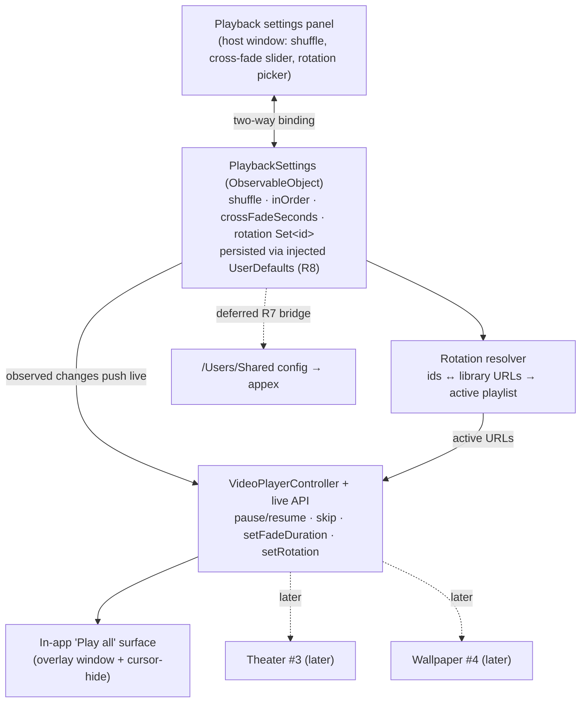

# Playback controls (shared control layer)

## Summary

Give the user a shared, persisted set of playback controls — play/pause, next/skip, shuffle vs. in-order, cross-fade duration, and which loops are in rotation — and make them apply live to the in-app player. The load-bearing move: unify the two playback paths by adding a live-control API to the existing cross-fade engine (`VideoPlayerController`) and backing the in-app "Play all" surface with it, so a cross-fade slider and a rotation picker actually take effect. Settings persist across launches. The screensaver keeps its current behavior this pass.

**Target repo:** `surrealism-application` (the Mac app). Paths below are relative to that repo.

---

## Problem Frame

The app has **two independent playback engines** and **no user controls**:

- `VideoPlayerController` — a true two-layer cross-fade engine (used by the screensaver extension and the hero preview), but its shuffle and 1.4 s cross-fade are fixed at init; it exposes only `start()`/`stop()` — no play/pause, skip, live shuffle, or settable fade.
- `FullScreenPlayer` — a separate static `AVQueuePlayer` that **hard-cuts** between clips (no cross-fade), driving "Play all" and click-to-play; also no controls.

So a control set that includes cross-fade is meaningless on today's in-app surface, and shuffle logic is duplicated across three call sites with no shared state. This plan builds the shared control layer that the later Theater (#3) and Wallpaper (#4) surfaces will consume.

This is the control *layer*. The dedicated on-demand player with an auto-hiding on-surface control overlay is Theater (origin R9–R11); this plan builds the model, the engine capability, persistence, and a host-window settings panel that the Theater surface will later present.

---

## Requirements

- R5. A shared control set: play/pause, next/skip, shuffle vs. in-order, cross-fade duration, and choosing which loops are in rotation. (origin R5, F2)
- R6. A settings change propagates immediately into the running in-app player — the engine picks up the new cross-fade/rotation/shuffle without a restart. (origin R6, narrowed: origin R6 spans theater + wallpaper; those surfaces are separate plans. See the R6 scope note.)
- R7. The screensaver keeps its current behavior (shuffle + cross-fade) this pass; wiring controls to the sandboxed appex is deferred. (origin R7)
- R8. Rotation and settings persist across launches. (origin R8)

Scope note on R5: this plan builds the **engine capability** for play/pause and next/skip and exposes shuffle, cross-fade, and rotation through a host-window settings panel. The **on-surface auto-hiding overlay** that surfaces play/pause/next during playback is Theater (origin R10) and is deferred (see Scope Boundaries).

Scope note on R6 (reachability): the live-propagation *mechanism* (settings → running engine) is built and unit-tested here (U6). But on a **single display** the fullscreen "Play all" overlay occludes the host window's settings panel and dismisses on click, so a user cannot drag the cross-fade slider *while watching* until either Theater's on-surface overlay (#3, origin R10) exists or a second display shows the panel. This plan does not claim the interactive drag-while-fullscreen UX on one display; it delivers the mechanism plus settings that take effect on the next/current "Play all".

---

## Key Technical Decisions

- KTD1. **Drive controls through `VideoPlayerController`; don't fork a second engine.** It already implements the hard part (two-layer cross-fade). Add the live-mutation API it lacks rather than building controls on `FullScreenPlayer`'s hard-cut queue. Both repo-research passes independently recommended this. (see origin: R11's "feel like the same product")

- KTD2. **Back the in-app "Play all" surface with `VideoPlayerController`.** Replace `FullScreenPlayer`'s `AVQueuePlayer` with the cross-fade engine, keeping `FullScreenPlayer`'s reusable chrome — the borderless overlay window (avoids the fullscreen Space-slide/black flash) and the 2.5 s cursor-hide idle timer. This makes cross-fade, shuffle, and rotation apply live on the in-app surface. Preserve the current framing: `FullScreenPlayer` uses `.resizeAspect` (letterbox, whole frame visible) while `VideoPlayerController` hardcodes `.resizeAspectFill` (crop) — make gravity settable on the engine and set `.resizeAspect` in the retrofit so "Play all" doesn't silently start cropping non-screen-aspect loops.

- KTD3. **One shared `PlaybackSettings` store, global for v1.** A `@MainActor final class … ObservableObject` mirroring `LicenseStore`: `@Published` state for live SwiftUI binding, `UserDefaults` injected via `init` for R8 persistence and testability, `app.surrealism.*` keys. Settings are global (one shared rotation/shuffle/cross-fade), not per-surface — the origin's open question resolved to "assume shared for v1." App-owned and injected via `.environmentObject`, like `LicenseStore`.

- KTD4. **Rotation is a set of stable loop identifiers, resolved to URLs at play time.** Persist `Set<String>` of identifiers; the identifier is the file stem (downloaded catalog loops are `<loopId>.mp4`; user-imported loops key off their filename). An empty selection means "all loops." A resolution step maps the persisted identifiers against `LibraryViewModel.videos` so a rotation survives loops being added/removed. (Research flagged the id/URL mismatch as a real gap.)

- KTD5. **Every mutation routes through `VideoPlayerController`'s disciplined observer-teardown path, and four specific invariants hold.** The documented top risk is AVPlayer memory creep + black-on-wake over long runs; ad-hoc `player.pause()` reintroduces it. Concretely:
  - **Skip/set-rotation guard.** `skip()` reuses `beginTransition()`, guarded against the `transitioning` flag and the `pendingFinish` work item. `setRotation()` carries the *same* guard: it must **cancel `pendingFinish`** and **re-validate `index`** against the new playlist count before installing it — otherwise a stale finish sets `index` out of range and the wake observer crashes on `playlist[index]`. (This requires `playlist` to become a `var`.)
  - **Effective fade ≤ clip length.** The end-trigger fires when `duration - current <= fadeDuration`; a fade longer than a short clip triggers at t≈0 and cascades into frozen-frame transitions. Clamp the *effective* fade to a fraction of the current clip's duration (e.g. `min(fadeDuration, clipDuration * 0.4)`) inside the trigger, evaluated per clip. Shortest reliably-supported clip length is an explicit assumption.
  - **Pause survives wake.** A new `paused` state means the wake observer's `pause();play()` nudge must respect it (early-return or re-pause after the nudge), or sleep/wake silently resumes a user-paused player. The same mid-transition guard extends to `pause()`/`resume()` before Theater surfaces them.
  - **Looper↔slots boundary.** `start()` picks the single-clip `AVPlayerLooper` path vs. the two-slot cross-fade path by `playlist.count == 1`; `setRotation` crossing that boundary at runtime (N→1 or 1→N) must tear down one path and stand up the other without a black flash — define which and cover it in the soak.

- KTD6. **Screensaver unchanged; design for a later `/Users/Shared` bridge.** The appex reads no settings today (R7 keeps it that way). Shape `PlaybackSettings` so it can later serialize to a shared `/Users/Shared` config file the sandboxed appex reads on launch, without reworking the store now. (origin: DECIDED "in-app surfaces now, screensaver later")

---

## High-Level Technical Design

One shared settings model feeds the engine; the engine drives every surface. This plan builds the model, the engine API, and the in-app surface + settings panel; Theater and Wallpaper are later consumers of the same two boxes.

---

## Implementation Units

### U1. Shared PlaybackSettings store + persistence

- Goal: A single observable, persisted source of truth for playback settings, owned by the app and injected everywhere.
- Requirements: R5, R8
- Dependencies: none
- Files: `AppexSaverMinimal/PlaybackSettings.swift` (new), `AppexSaverMinimal/AppexSaverMinimalApp.swift` (own + inject like `LicenseStore`), `AppexSaverMinimal/ContentView.swift` (consume via `@EnvironmentObject`), `AppexSaverMinimal/PlaybackSettingsTests.swift` (new)
- Approach: `@MainActor final class PlaybackSettings: ObservableObject` with `@Published` `shuffle: Bool`, `crossFadeSeconds: Double`, and `rotation: Set<String>` (empty = all). `init(defaults: UserDefaults = .standard)`; read/write `app.surrealism.playback.shuffle` / `.crossFade` / `.rotation` (a string array). Mirror `LicenseStore`'s injectable-defaults shape exactly. Instantiate once in `AppDelegate` and inject via `.environmentObject`. In-order vs. shuffle is the single `shuffle` bool (in-order = false).
- Patterns to follow: `Commerce/LicenseStore.swift` (injectable `UserDefaults`, `@Published private(set)`, `app.surrealism.*` keys); `AppexSaverMinimalApp.swift` AppDelegate ownership + `.environmentObject`.
- Test scenarios:
  - Happy path: setting shuffle / crossFadeSeconds / rotation updates the `@Published` value and persists to the injected defaults.
  - Round-trip: a second store built on the same suite reads back the persisted values.
  - Edge: crossFadeSeconds clamps to a sane range (e.g. 0.2–5.0 s); out-of-range input is clamped, not stored raw.
  - Edge: empty rotation persists and reloads as empty (interpreted as "all").
  - Defaults: a fresh store with an empty suite yields sensible defaults (shuffle on, ~1.4 s cross-fade to match today).
- Verification: settings survive relaunch; a unit test injecting a `UUID`-named suite proves round-trip persistence and `@Published` observation.

### U2. Rotation resolver (ids ↔ library URLs)

- Goal: Turn the persisted identifier set into the ordered list of local URLs to play, resolved against the current library.
- Requirements: R5, R8
- Dependencies: U1
- Files: `AppexSaverMinimal/RotationResolver.swift` (new), `AppexSaverMinimal/RotationResolverTests.swift` (new); reference `ContentView.swift` (`LibraryViewModel`, `LibraryVideo`), `VideoPlayerController.swift` (`VideoCache`)
- Approach: A pure function/type mapping `rotation: Set<String>` + the library (`[LibraryVideo]` or `VideoCache.videos()`) → the active `[URL]`. Identifier = file stem (downloaded loops = `<loopId>`; imported = filename stem). Empty selection resolves to all loops. Ignore identifiers whose file no longer exists. Keep it pure (no AVFoundation) so it is fully unit-testable.
- Patterns to follow: `LibraryVideo.displayName` numeric-name handling (`ContentView.swift`); `VideoCache.videos()` ordering.
- Test scenarios:
  - Happy path: a rotation of two ids resolves to exactly those two URLs.
  - Edge: empty rotation resolves to the full library.
  - Edge: an id whose file was deleted is dropped from the result (no crash, no nil URL).
  - Edge: a downloaded loop (`loop-12.mp4`) and a user-imported file (`my clip.mov`) both resolve by stem.
  - Edge: rotation referencing only missing files resolves to empty → caller falls back to all (define and test the fallback).
- Verification: selecting a subset in the panel (U5) plays exactly that subset; deleting a rotation loop degrades gracefully.

### U3. VideoPlayerController live-control API

- Goal: Add the mutation API the engine lacks — pause/resume, skip, settable cross-fade, and rebuild-rotation — without reintroducing the observer/teardown bugs.
- Requirements: R5, R6, R7
- Dependencies: none (engine-local)
- Files: `AppexSaverMinimal/VideoPlayerController.swift` (extend), `AppexSaverMinimal/VideoPlayerControllerTests.swift` (new, pure-logic portions only)
- Approach: Add `pause()`/`resume()` (both slots), `skip()` (reuse `beginTransition()`, guarded by `transitioning` and `pendingFinish` — a no-op or queued if mid-fade), `setFadeDuration(_:)` (make `fadeDuration` a `var`; the periodic `watchForEnd` closure already reads it live each tick, so no re-arm is needed — an in-flight transition keeps its captured duration, which is acceptable), a settable `videoGravity` (currently hardcoded `.resizeAspectFill` on both slots), and `setRotation(_ urls: [URL], shuffle: Bool)`. `setRotation` must: cancel `pendingFinish`, tear down the periodic/end observers, make `playlist` a `var` and replace it, **re-validate `index`** against the new count (reset if out of range), and re-arm — all under the `transitioning` guard so a shrink-while-fading can't leave a stale index. Handle the `count == 1` boundary explicitly (N↔1 switches between the `AVPlayerLooper` path and the two-slot path — see KTD5). The wake observer must respect a new `paused` flag so sleep/wake doesn't resume a user-paused player. Apply the effective-fade clamp (KTD5) inside the end-trigger. Do not re-create players per clip; reuse the two slots.
- Execution note: characterization-first — capture the current start→transition→advance behavior before adding mutation, so a guarded `skip()`/`setRotation()` doesn't corrupt the `index`/`active` slot state machine.
- Patterns to follow: existing `beginTransition()`, `watchForEnd(of:)`, `fade(_:to:)`, `stop()` teardown, and `installWakeObserver()` in the same file.
- Test scenarios:
  - Pure logic: `setRotation` rebuilds the playlist to the given URLs; with `shuffle: false` order is preserved, with `shuffle: true` it is a permutation of the same set.
  - Pure logic: single-clip rotation still routes to the `AVPlayerLooper` path.
  - Guard: `skip()` while `transitioning` does not start a second overlapping fade (no double-advance).
  - Guard: `setRotation` that shrinks the playlist while a transition is in flight re-validates `index` (no out-of-range subscript) — the crash-on-wake case.
  - Edge: a clip shorter than the configured cross-fade uses the clamped effective fade (no t≈0 transition cascade).
  - Soak: N→1 and 1→N `setRotation` mid-playback switches engine paths without a black flash.
  - Soak: pause → sleep → wake leaves the player still paused (wake nudge respects `paused`).
  - Note: AVFoundation playback/teardown itself is verified by manual soak (project convention), not unit tests — the guard-logic and playlist-rebuild bits above are unit-testable.
- Verification: manual soak — long run with repeated skip/pause/resume/fade-change/rotation-change shows no black-on-wake, no memory creep, no out-of-range crash, correct slot ownership after each skip, and pause surviving sleep/wake.

### U4. Retrofit the in-app "Play all" surface onto the cross-fade engine

- Goal: Make the in-app fullscreen player use `VideoPlayerController` (cross-fade) driven by the shared settings, keeping the overlay-window + cursor-hide chrome.
- Requirements: R5, R6
- Dependencies: U1, U2, U3
- Files: `AppexSaverMinimal/Commerce/FullScreenPlayer.swift` (retrofit), `AppexSaverMinimal/ContentView.swift` ("Play all" + tile tap call sites), `AppexSaverMinimal/Commerce/CatalogView.swift` (catalog play call site)
- Approach: Replace `FullScreenPlayer`'s `AVQueuePlayer` playlist path with a `VideoPlayerController` attached to the overlay window's content layer, initialized from the resolved rotation (U2) + `PlaybackSettings` (shuffle, cross-fade). Set the engine's `videoGravity` to `.resizeAspect` to preserve today's letterbox framing (the engine defaults to `.resizeAspectFill`/crop — KTD2). Keep `present`/`OverlayWindow`, the fade-in, `presentationOptions`, and the cursor-hide timer. Preserve today's click/Esc-to-exit behavior (an on-surface control overlay is Theater #3, deferred — see Scope Boundaries), so the fullscreen surface stays click-to-dismiss for now. Note the reachability limit (KTD-R6 scope note): on a single display this overlay occludes the settings panel, so live drag-while-watching isn't reachable this pass — the retrofit proves cross-fade/rotation are honored *at launch*; live re-drag lands with Theater (#3) or a second display. Single-clip taps (click-to-play one loop) keep the looping path.
- Patterns to follow: `FullScreenPlayer.present`/`OverlayWindow`/`cursorActivity`; `PreviewView`'s attach + placeholder-color override to avoid the load-gap black flash on a non-black surface.
- Test scenarios:
  - Manual: "Play all" cross-fades between clips (no hard cut) and honors the current shuffle + rotation.
  - Manual: click-to-play a single tile loops that clip; Esc and click still exit.
  - Manual: no black flash on entry (placeholder override applied).
  - Edge: "Play all" with an empty rotation falls back to the full library.
  - Test expectation: playback wiring is manual-soak-verified per convention; the resolver/settings inputs are covered by U1/U2 unit tests.
- Verification: launching "Play all" plays the chosen rotation with cross-fades at the configured duration; exit paths unchanged.

### U5. Playback settings panel (host window)

- Goal: A "Playback" section in the app window to set shuffle, cross-fade duration, and which loops are in rotation — bound live to the shared store.
- Requirements: R5, R6, R8
- Dependencies: U1, U2
- Files: `AppexSaverMinimal/PlaybackControlsView.swift` (new), `AppexSaverMinimal/ContentView.swift` (place the section in `body`, alongside `screensaverSection`)
- Approach: A `card { }`-styled section with a shuffle `Toggle`, a cross-fade `Slider` (0.2–5.0 s, live seconds label), and a rotation picker over `LibraryViewModel.videos` (multi-select; "all" when none chosen). Bind two-way to `PlaybackSettings` so edits persist and propagate live (U6). Style toggle/slider ad hoc against the dark theme (no existing `ToggleStyle`/`SliderStyle` in the app). Use `SurrealismMark`/`PrimaryButtonStyle`/`GhostButtonStyle` for consistency.
- Patterns to follow: `ContentView.swift` `card { }` builder, `screensaverSection` layout, `CatalogView` tag/selection capsules for the loop picker; brand rule — clean controls, no rainbow.
- Test scenarios:
  - Happy path: toggling shuffle / dragging the slider / selecting loops writes through to `PlaybackSettings` (assert the model, not pixels).
  - Edge: deselecting all loops sets rotation to empty (= all) and the label communicates "all loops".
  - Edge: the slider is clamped to the model's range.
  - Test expectation: view logic is thin; assert via the bound `PlaybackSettings` model (U1 store) rather than snapshotting SwiftUI.
- Verification: changing a control in the panel updates the model, persists across relaunch, and (with U6) changes the running player.

### U6. Live propagation: settings → running player

- Goal: Build and unit-test the mechanism that pushes a settings change into a running player, so the engine picks up a new cross-fade/rotation/shuffle without a restart (R6). (Interactive drag-while-fullscreen is gated on Theater/second-display reachability — see the R6 scope note; this unit delivers and verifies the propagation path, not that UX.)
- Requirements: R6
- Dependencies: U1, U3, U4, U5
- Files: `AppexSaverMinimal/Commerce/FullScreenPlayer.swift` (observe settings), `AppexSaverMinimal/PlaybackSettings.swift` (expose change signal if needed), `AppexSaverMinimal/PlaybackPropagationTests.swift` (new, against a fake engine)
- Approach: While a `VideoPlayerController` is active, observe `PlaybackSettings` — a cross-fade change calls `setFadeDuration`, a rotation/shuffle change calls `setRotation(resolvedURLs, shuffle:)`. Debounce so a slider drag doesn't rebuild the playlist on every tick: fade duration can update continuously (the engine reads it live per tick), rotation rebuilds only on commit. Define an engine protocol seam (`protocol PlaybackEngine`) so propagation is unit-testable with a fake — this is how R6 is verified without driving real AVFoundation.
- Patterns to follow: `ObservableObject`/`@Published` observation used across the app; the DI-fake seam from `LicenseStoreTests`.
- Test scenarios:
  - Happy path: changing crossFadeSeconds on the model invokes `setFadeDuration` on the (fake) engine with the new value.
  - Happy path: changing rotation invokes `setRotation` with the resolved URLs and current shuffle.
  - Edge: rapid slider changes debounce rotation rebuilds (fade duration may update continuously; rotation rebuild fires once on commit).
  - Edge: settings changes with no active player are a no-op (no crash).
- Verification: unit tests against the fake engine prove each settings change invokes the right engine call with the right value; end-to-end, a settings change applied to a running player (reached via a second display or, later, Theater's overlay) re-times transitions / swaps the set without a restart.

---

## Acceptance Examples

- AE1. **Live cross-fade (mechanism).** Given a running player and a cross-fade change on the shared settings, when the change propagates, then subsequent transitions use the new duration without restarting playback. (R5, R6 — verified via the engine seam; the interactive drag-while-fullscreen UX on one display is gated on Theater/second display per the R6 scope note.)
- AE2. **Rotation subset.** Given the user selects 3 of 20 loops in the panel, when they "Play all", then only those 3 play (shuffled or in order per the toggle). (R5)
- AE3. **Persistence.** Given the user sets shuffle off and a 3 s cross-fade, when they quit and relaunch, then those settings are still in effect. (R8)
- AE4. **Screensaver untouched.** Given the settings changed in-app, when the screensaver runs, then it behaves as before (shuffle + 1.4 s cross-fade) — controls do not reach the appex this pass. (R7)
- AE5. **Graceful rotation.** Given a rotation references a loop that was deleted, when the user plays, then the missing loop is skipped and the rest play (empty result falls back to all). (R5)

---

## Alternatives Considered

- **Build controls on `FullScreenPlayer`'s hard-cut queue, leave `VideoPlayerController` alone.** Rejected: cross-fade — an explicit R5 control — can't be honored by a hard-cut queue, so the in-app surface would never fade and R6/R11's "same product feel" fails. Chosen approach unifies on the cross-fade engine.
- **Add a minimal on-surface control overlay (play/pause/next) to the fullscreen player now.** Deferred: an auto-hiding on-surface overlay is the Theater surface (origin R10); pulling it forward blurs the #2/#3 boundary and collides with the current click-to-exit behavior. The engine API built here (pause/resume/skip) is ready for Theater to drive.
- **Per-surface settings (theater vs. wallpaper differ).** Deferred: origin resolved to shared/global for v1; a per-surface split can layer on later without reworking the store.

---

## Scope Boundaries

### In scope
The shared control layer: a persisted `PlaybackSettings` store, the live-control API on `VideoPlayerController` (pause/resume, skip, settable cross-fade, set-rotation), the rotation resolver, a host-window Playback settings panel (shuffle, cross-fade, rotation), and retrofitting the in-app "Play all" surface onto the cross-fade engine so settings apply live.

### Deferred to follow-up work
- **On-surface auto-hiding control overlay** (play/pause/next during playback) — belongs to Theater (#3, origin R10); the engine API here is built to drive it.
- **Screensaver control-bridge** — a `/Users/Shared` settings file the appex reads on launch, so rotation/shuffle/cross-fade also shape the screensaver (origin "Deferred for later"). The store is shaped to serialize there later.
- **Windowed (non-fullscreen) theater player** and per-surface settings — Theater (#3).
- **Playlists / collections / moods** beyond a simple rotation selection. (origin "Deferred for later")

### Outside this product's identity
- **Audio-reactive visualizer** — a separate future product. (origin "Outside this product's identity")

---

## Risks & Dependencies

- **AVPlayer observer teardown / black-on-wake / memory creep.** The historically fiddly part; the prior screensaver plan named it the top risk. Mitigation: every new pause/resume/skip/set-rotation routes through the existing disciplined teardown (reuse the two slots, tear down periodic/end/wake observers before re-arming); `skip()` guarded against `transitioning` + `pendingFinish`; a long soak test (repeated skip/pause/fade-change) before ship.
- **Two shuffle call sites → one.** Consolidating `VideoPlayerController.init`, `FullScreenPlayer.playPlaylist`, and the screensaver default behind the shared model risks subtle behavior drift; the screensaver default stays unchanged (R7).
- **Rotation id/URL mismatch** for user-imported loops (keyed by filename, not a catalog id). Mitigation: resolve by file stem and drop missing ids (U2).
- **Click-to-exit vs. controls, and single-display reachability.** The in-app fullscreen surface stays click-to-dismiss this pass and occludes the settings panel, so on a single display the user can't drag a control *while watching* — this plan ships the propagation mechanism + at-launch application, and the interactive drag-while-fullscreen UX lands with Theater's on-surface overlay (#3) or a second display. Reconciling a persistent overlay with dismissal is Theater's problem.
- **`videoGravity` regression.** The engine crops (`.resizeAspectFill`) where `FullScreenPlayer` letterboxes (`.resizeAspect`); the retrofit must set `.resizeAspect` (KTD2/U4) or "Play all" silently starts cropping non-screen-aspect loops.
- **Mutation-mid-transition invariants.** Long-fade-on-short-clip cascade, `setRotation`-shrink out-of-range crash, wake resuming a paused player, and N↔1 path switching are all real failure modes on this engine — all guarded per KTD5; the soak test must exercise each.
- **Dependencies:** the shipped `AppexSaverMinimalTests` target (module `Surrealism`, `@testable import Surrealism`); `VideoCache` / `LibraryViewModel` as the loop source; no backend or network dependency.

---

## Sources / Research

- Origin requirements: `docs/brainstorms/2026-07-11-ambient-surrealism-app-improvements-requirements.md` (R5–R8, F2, the "in-app surfaces now, screensaver later" decision, the global-vs-per-surface open question).
- Engine + surfaces: `AppexSaverMinimal/VideoPlayerController.swift` (two-slot cross-fade, `fadeDuration` fixed at init, `start()`/`stop()` only, wake observer + teardown), `AppexSaverMinimal/Commerce/FullScreenPlayer.swift` (hard-cut `AVQueuePlayer`, overlay window, cursor-hide), `AppexSaverMinimal/PreviewView.swift` (placeholder-color override for the load-gap black flash).
- Library + persistence: `AppexSaverMinimal/ContentView.swift` (`LibraryViewModel`, `LibraryVideo`, `card`/button styles, AppDelegate injection), `VideoCache` in `VideoPlayerController.swift`, `AppexSaverMinimal/Commerce/LoopDownloader.swift` (`<loopId>.mp4` naming), `AppexSaverMinimal/Commerce/LicenseStore.swift` (injectable-UserDefaults ObservableObject to mirror).
- Prior plan (risk provenance): `docs/plans/2026-07-05-001-feat-video-screensaver-plan.md` (AVPlayer memory/black-on-wake risk, observer teardown, soak-test budget).
- Test convention: `AppexSaverMinimal/Commerce/LicenseStoreTests.swift` (module `Surrealism`, injected `UserDefaults(suiteName:)`, DI fakes).
