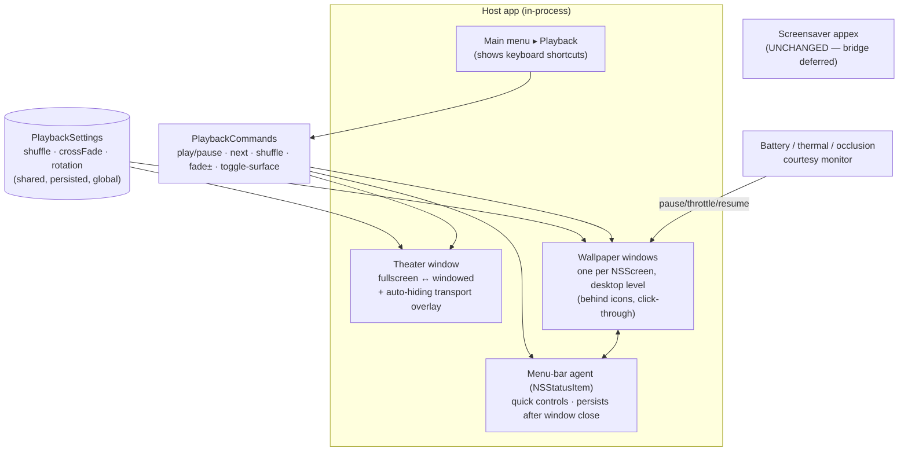

# feat: Ambient surfaces — in-app Theater + Desktop Wallpaper mode (v1)

## Summary

Add the two remaining "surfaces" from the Ambient Surrealism pass to the host app,
both driven by the **already-shipped shared playback controls** (`PlaybackSettings`
+ `VideoPlayerController`):

1. **Theater** (R9–R11) — an on-demand player to watch the current rotation
   **fullscreen or windowed**, with a discoverable control surface: an
   auto-hiding on-screen transport overlay, **keyboard shortcuts**, and a macOS
   main-menu **Playback** command group. Builds directly on the existing
   `FullScreenPlayer` (which already does fullscreen cross-fade playback +
   cursor auto-hide).
2. **Desktop Wallpaper** (R12–R16) — a **"Set as wallpaper"** action that plays
   the rotation in a **borderless window pinned to the desktop level** (behind
   icons, Plash-style — *not* an aerial-slot rewrite), one per display, run from
   a **menu-bar agent** so it persists after the main window closes, with
   **battery/occlusion courtesy** and a clean stop that **never touches system
   wallpaper files**.

Both surfaces reuse one **shared, global** rotation/shuffle/cross-fade setting
(v1). The screensaver's behavior is untouched (its control-bridge stays
deferred). This is presentation + lifecycle work: no change to how loops are
downloaded, cached, or licensed.

**Target repo:** `surrealism-application` (the Mac app). No backend changes.

---

## Problem Frame

The app now has shared playback controls (shuffle, cross-fade, Choose Loops),
but they only shape the passive screensaver and the bare `FullScreenPlayer`.
Two gaps remain from the Ambient Surrealism brainstorm:

- **No real place to actively watch.** `FullScreenPlayer` plays the rotation
  fullscreen with cross-fades and auto-hides the cursor, but has **no transport
  controls and no windowed mode** — it only exits on Esc/click. There is no
  discoverable way to pause, skip, shuffle, or adjust cross-fade *while
  watching*, and nothing communicates that control is possible (the settings
  live in a host-window panel the viewer can't see).
- **The art only appears on idle.** There is no always-on ambient presence on
  the desktop.

The playback engine already exposes the needed live controls
(`VideoPlayerController.pause()/resume()/skip()/setRotation()/setFadeDuration()`)
and `FullScreenPlayer` already live-drives from `PlaybackSettings` via
`PlaybackPropagator`. The new work is the **control-affordance layer** (overlay +
keyboard + menu), a **windowed** presentation, and the **wallpaper surface**
(desktop-level window per display, a menu-bar agent, and battery courtesy).

---

## High-Level Technical Design

One shared settings object (`PlaybackSettings`) feeds three surfaces. Theater and
Wallpaper are host-process AppKit windows, each backed by `VideoPlayerController`
and live-driven by `PlaybackPropagator` — the same pattern `FullScreenPlayer`
uses today. The screensaver (sandboxed appex) is unchanged.



**Control affordances (the discoverability model — applies to all three
surfaces).** Every surface exposes the same command set through four channels so
control is both possible and discoverable:

- **On-screen overlay** — auto-hiding transport (play/pause, next, shuffle,
  cross-fade, fullscreen/windowed, current-loop label), revealed on mouse-move
  **or any key press / VoiceOver focus** (so keyboard-only and VoiceOver users can
  reach it — mouse-move is not the only reveal), hidden on idle (Theater reuses the
  existing cursor-idle timer).
- **Keyboard** — `Space` play/pause, `→`/`N` next, `S` shuffle, `[` / `]`
  cross-fade −/+, `F` fullscreen↔windowed, `Esc` exit *(directional; final
  mapping tuned in implementation)*.
- **macOS main menu ▸ Playback** — the canonical always-present surface; each
  item renders **its shortcut**, so the keys are self-documenting.
- **Menu-bar item** (Wallpaper) — quick controls where there is no window to click.

A brief **first-run hint overlay** lists the keys the first time Theater opens.

**Wallpaper window mechanism.** A borderless `NSWindow` per `NSScreen` at the
**desktop-icon window level minus one** (`CGWindowLevelForKey(.desktopIconWindow) - 1`),
`collectionBehavior = [.canJoinAllSpaces, .stationary, .ignoresCycle]`,
`ignoresMouseEvents = true` (clicks pass through to the desktop), sized to each
screen's `frame`, backed by `VideoPlayerController`. Stopping closes our windows
only — the user's system wallpaper is never read or written (R16). This is the
Plash technique the brainstorm decided on; it sidesteps the macOS-26 aerial-slot
breakage because it is *our* window.

**Lifecycle.** The app keeps its dock icon (decided). A menu-bar `NSStatusItem`
is installed on first wallpaper start and hosts quick controls. Wallpaper windows
are owned by an app-level controller (not the SwiftUI `WindowGroup`) — **but object
ownership alone does not keep the process alive**: a SwiftUI `WindowGroup` app can
terminate on last-window-close. So U4 must implement
`applicationShouldTerminateAfterLastWindowClosed` to return **false while wallpaper
is active** (with an explicit menu-bar **Quit**), so closing the main window leaves
wallpaper running. Reopening the main window from the status item routes through
`NSApp` (`applicationShouldHandleReopen` / an `openWindow` bridge), since a plain
`NSStatusItem` action can't recreate a SwiftUI scene window directly.

**Idle-sleep policy.** Hold a prevent-idle-sleep assertion **for Theater only**
(active watching). Wallpaper does **not** hold one — a persistent assertion would
keep the display awake indefinitely and directly defeat the battery courtesy
(R14). Any wallpaper assertion, if added, must be tied to actual play state so the
courtesy monitor's pause releases it.

---

## Requirements

Carried from origin (`docs/brainstorms/2026-07-11-ambient-surrealism-app-improvements-requirements.md`).
Account login (R1–R4) and playback controls (R5–R8) shipped **after** the
2026-07-11 origin was written (login 2026-07-11; controls + Choose-Loops through
2026-07-12), so this plan **consumes** them rather than building them — the
origin's problem-frame describing them as gaps is now historical.

**Theater**
- **R9.** A dedicated on-demand player to watch loops inside the app, **fullscreen or windowed**, building on `FullScreenPlayer`/`VideoPlayerController`.
- **R10.** The theater exposes the shared controls (play/pause, skip, shuffle, cross-fade, pick loop) via a clean, auto-hiding overlay. *(Plan-local addition, not from origin R10: keyboard shortcuts + a macOS Playback menu + a first-run key hint are added as discoverability channels, per explicit direction during planning — the origin asked only for the overlay.)*
- **R11.** Theater plays the current rotation and honors the same cross-fade transitions as the screensaver, so it feels like the same product.

**Desktop wallpaper**
- **R12.** A **"Set as wallpaper"** action plays the current rotation in a borderless window pinned to the desktop level (behind icons), Plash-style — not the aerial-slot rewrite.
- **R13.** Wallpaper runs from a **menu-bar agent** so it persists after the main window closes, with quick controls (play/pause, next, stop wallpaper) in the menu-bar item.
- **R14.** **Battery/thermal courtesy:** pause or throttle wallpaper when on battery and/or fully occluded; resume when visible/plugged. Default configurable — **courtesy ON by default** (decided).
- **R15.** **Multi-display:** show the wallpaper on all displays; per-display loop selection is deferred (nice-to-have).
- **R16.** Turning wallpaper off cleanly restores the normal desktop; **never overwrite system wallpaper files**.

**Cross-cutting**
- **R17.** "Ambient Surrealism" positioning in-app: screensaver / wallpaper / theater presented as one coherent product ("screensaver" kept where it aids clarity/SEO).
- **R18.** No regression to what shipped: notarized build, macOS-26 settings deep-link, glossy orb, "Surrealism" naming, iris fallback.

---

## Key Technical Decisions

- **KTD1 — Theater extends `FullScreenPlayer`, it is not a new player.** `FullScreenPlayer` already presents the rotation fullscreen with cross-fades, live-driven by `PlaybackSettings` via `PlaybackPropagator`, and auto-hides the cursor. Theater adds (a) the transport overlay, (b) keyboard handling, (c) a windowed presentation option. Rationale: the engine and live-settings wiring exist; a from-scratch player would duplicate and risk cross-fade parity.
- **KTD2 — One shared command set (`PlaybackCommands`) behind four affordances.** Extract the surface-agnostic actions (play/pause, next, toggle shuffle, cross-fade ±, toggle fullscreen/windowed, stop) into one type that mutates `PlaybackSettings` and drives the **active surface's controller _set_** — the single Theater controller, or the **one-controller-per-display** wallpaper set (KTD7). Transport actions **fan out to every controller in the active set** (a menu-bar "next" advances all displays together), and the type resolves which set is active when Theater and Wallpaper are both live. The overlay buttons, keyboard handler, main-menu items, and menu-bar item all call it — no per-surface control logic. Rationale: guarantees the surfaces behave identically, keeps multi-display wallpaper in sync, and makes the keyboard/menu mapping testable in isolation. (The Visualizer plan (002) could reuse this model for consistency — noted for whoever plans 002, not a mandate here.)
- **KTD3 — Wallpaper = Plash-style desktop-level window per display; system wallpaper is never touched.** Borderless `NSWindow` per `NSScreen` at `.desktopIconWindow - 1`, all-spaces + stationary, click-through, backed by `VideoPlayerController`. Rejected: rewriting Apple's aerial-slot files (unsupported, reaches the lock screen, and is the exact terrain that broke the screensaver on macOS 26). Rationale: safe, reuses the engine, survives OS updates, cleanly reversible (R16).
- **KTD4 — Menu-bar agent via `NSStatusItem`, dock icon retained.** Installed on first wallpaper start (not at launch), owned at app level so it outlives the main window. The app stays a normal dock app (decided) — reopening the main UI stays discoverable. Rationale: wallpaper needs an owner that survives window close; keeping the dock avoids a disorienting "where did my app go" moment.
- **KTD5 — Courtesy monitor ON by default, with a visible toggle and a distinct paused state.** A monitor pauses/throttles wallpaper playback on battery (power-source change) and on full occlusion (`NSWindow.occlusionState`), resuming when plugged/visible. The **courtesy toggle lives in the menu-bar menu** (and mirrors into a wallpaper control in `ContentView`) so it's discoverable, and when the monitor is the cause of a pause the menu-bar item shows a **distinct label** ("Paused — on battery") so a courtesy-pause is never mistaken for a user pause. **Prefer low-cadence _throttle_ over hard pause** so the "always-on ambient" promise still reads as alive on battery for laptop users (hard pause can look broken; tuned in impl). Rationale: R14 intent is battery protection out of the box without silently killing the marquee experience or hiding the override.
- **KTD6 — Shared global settings across surfaces (v1).** Theater and wallpaper both read/write the one `PlaybackSettings`; changing shuffle/cross-fade/rotation in one is reflected in the other and persists. Per-surface settings are deferred. Rationale: matches the brainstorm's v1 assumption and the existing single-store design; avoids a settings-scope refactor.
- **KTD7 — Wallpaper owns one `VideoPlayerController` per screen; a window-set manager handles display changes.** On `NSApplication.didChangeScreenParametersNotification`, add/remove/reposition wallpaper windows to match current `NSScreen.screens`. Rationale: multi-display (R15) and hot-plug are common; a set manager keeps the per-screen controllers and windows in sync without leaks.

---

## Output Structure

New files under an `Ambient/` group in the host app target (screensaver appex
untouched). `Theater*` promote `FullScreenPlayer`'s pattern; `Wallpaper*` and the
menu-bar agent are new.

```
AppexSaverMinimal/
├── Ambient/
│   ├── PlaybackCommands.swift        # (KTD2) surface-agnostic command set over PlaybackSettings + active controller
│   ├── PlaybackShortcuts.swift       # keymap → PlaybackCommands; main-menu "Playback" builder
│   ├── TheaterWindow.swift           # fullscreen ↔ windowed presentation (extends FullScreenPlayer's approach)
│   ├── TheaterControlsOverlay.swift  # auto-hiding transport overlay + first-run hint
│   ├── WallpaperController.swift     # per-screen desktop-level window set + display-change handling
│   ├── WallpaperWindow.swift         # borderless desktop-level NSWindow (level, collectionBehavior, click-through)
│   ├── MenuBarAgent.swift            # NSStatusItem + quick controls; lifecycle (persist after window close)
│   └── CourtesyMonitor.swift         # battery/thermal/occlusion → pause/throttle/resume
└── ContentView.swift                 # add "Watch in Theater" + "Set as wallpaper" entry points + Ambient framing
```

---

## Implementation Units

Grouped into phases. Theater ships first (smaller, lower-risk, extends existing
code); wallpaper's menu-bar/desktop-window infrastructure follows; courtesy +
framing last.

### Phase A — Theater

### U1. Shared command set + keyboard + Playback menu

- **Goal:** One surface-agnostic `PlaybackCommands` set, a keymap that drives it, and a macOS main-menu **Playback** group that renders the shortcuts.
- **Requirements:** R5 (reuse), R10.
- **Dependencies:** none.
- **Files:** `AppexSaverMinimal/Ambient/PlaybackCommands.swift`, `AppexSaverMinimal/Ambient/PlaybackShortcuts.swift`, `AppexSaverMinimal/VideoPlayerController.swift` (add a test/internal `isPaused` accessor — `paused` is currently `private`, so the play/pause test can't observe it); test `AppexSaverMinimalTests/PlaybackCommandsTests.swift`.
- **Approach:** `PlaybackCommands` wraps the shared `PlaybackSettings` and a provider of the **active controller set** (the single Theater controller, or the per-display wallpaper controllers — KTD2/KTD7), exposing `playPause / next / toggleShuffle / crossFadeStep(±) / togglePresentation / stop`. Transport actions **fan out to every controller in the active set**. `PlaybackCommands` **owns its own desired-play state** (it does not read the controller's `private var paused`); `playPause` flips that state and drives `pause()/resume()` on the set. Other actions map to existing calls (`skip/setShuffle/setCrossFadeSeconds`). `PlaybackShortcuts` maps key events → commands and builds an `NSMenu` "Playback" group whose `NSMenuItem`s carry `keyEquivalent`s (so shortcuts are self-documenting) and are **disabled when no surface is active**. Cross-fade step clamps to `PlaybackSettings.fadeRange`.
- **Patterns to follow:** `PlaybackSettings` setters; `VideoPlayerController` live-control API; existing accent color / `GhostButtonStyle`.
- **Test scenarios:**
  - `playPause` flips `PlaybackCommands`' desired-play state and calls `pause()`/`resume()` on every controller in the active set (observed via the new `isPaused` accessor); `next` calls `skip` on each.
  - `crossFadeStep(+)` at the range ceiling stays clamped (no overflow); `crossFadeStep(-)` at the floor stays clamped.
  - `toggleShuffle` flips and persists `PlaybackSettings.shuffle`.
  - Fan-out: with a 3-controller (multi-display) set, `next`/`playPause` reach all three, not just one.
  - Each Playback menu item exposes the expected `keyEquivalent`, is disabled when no surface is active, and when enabled triggering it invokes the matching command (map integrity).
- **Verification:** Commands mutate settings/engine correctly across the whole active set; the Playback menu lists every action with its shortcut and greys out when nothing is playing.

### U2. Theater window: transport overlay, fullscreen ↔ windowed, first-run hint

- **Goal:** Promote `FullScreenPlayer` into a Theater with an auto-hiding transport overlay, a windowed mode, and a discoverability hint.
- **Requirements:** R9, R10, R11.
- **Dependencies:** U1.
- **Files:** `AppexSaverMinimal/Ambient/TheaterWindow.swift`, `AppexSaverMinimal/Ambient/TheaterControlsOverlay.swift`, `AppexSaverMinimal/Commerce/FullScreenPlayer.swift` (refactor shared presentation out or extend); test `AppexSaverMinimalTests/TheaterPresentationTests.swift`.
- **Approach:** Reuse `FullScreenPlayer`'s overlay-window + `VideoPlayerController` + `PlaybackPropagator` presentation. Add an overlay `NSView`/SwiftUI hosting layer with transport buttons bound to `PlaybackCommands`, revealed by the existing cursor-idle timer (show on mouse-move, fade on idle) and never capturing the click-to-exit unless a control is hit. `F` / a control toggles between borderless-fullscreen and a standard resizable window (reposition the same container + controller into a titled `NSWindow`). Show a one-time hint overlay (keys legend) on first Theater open, persisted via `UserDefaults`; it **auto-fades after a few seconds or on any key/click, and must not consume that first command or the click-to-exit gesture**. Reveal the transport overlay on **key press / VoiceOver focus as well as mouse-move** (accessibility).
- **Patterns to follow:** `FullScreenPlayer.present()` (overlay window, alpha fade-in, `cursorActivity()` idle timer, `PlaybackPropagator` live-drive).
- **Test scenarios:**
  - First-run hint shows once, then never again (defaults flag round-trips).
  - Presentation toggle preserves the running controller (no restart / no black frame) — asserted on the presentation model; window behavior verified by running.
  - `Test expectation: overlay auto-hide, fullscreen↔windowed, and control clicks-vs-exit verified by running; unit tests cover the presentation-state model + first-run flag.`
- **Verification:** Theater opens fullscreen playing the rotation with cross-fades; controls appear on mouse-move and hide on idle; `F` toggles windowed; keys and the Playback menu both work; Esc exits.

### Phase B — Wallpaper surface

### U3. Desktop-level wallpaper window set (per display)

- **Goal:** Play the rotation in borderless desktop-level windows (behind icons, click-through), one per screen, reusing the engine.
- **Requirements:** R12, R15, R16.
- **Dependencies:** U1 (commands); independent of U2.
- **Files:** `AppexSaverMinimal/Ambient/WallpaperWindow.swift`, `AppexSaverMinimal/Ambient/WallpaperController.swift`; test `AppexSaverMinimalTests/WallpaperControllerTests.swift`.
- **Approach:** `WallpaperWindow` = borderless `NSWindow` at `CGWindowLevelForKey(.desktopIconWindow) - 1`, `collectionBehavior = [.canJoinAllSpaces, .stationary, .ignoresCycle]`, `ignoresMouseEvents = true`, `isOpaque = true`, frame = screen `frame`, content backed by a `VideoPlayerController` (per screen) attached like `FullScreenPlayer` does. `WallpaperController` owns the set: start builds one window+controller per `NSScreen`, live-drives each from `PlaybackSettings`, and on `didChangeScreenParametersNotification` reconciles the set (add new screens, drop removed, reposition). Stop closes/releases all windows+controllers — no system-wallpaper read/write. Same-clip vs per-screen-offset start is an impl detail (default: same rotation, independent phase).
- **Patterns to follow:** `FullScreenPlayer` (window + `VideoPlayerController.attach` + `PlaybackPropagator`); `LibraryViewModel` teardown discipline.
- **Test scenarios:**
  - Window config: level equals desktop-icon-level − 1, mouse events ignored, all-spaces + stationary set (assert on the configured window object).
  - Set reconciliation: given a simulated screen list change (2→1, 1→3), the controller creates/destroys exactly the right windows with no leaked controllers.
  - Stop tears down every window + controller and never calls any system-wallpaper API (no `NSWorkspace.setDesktopImageURL`).
  - `Test expectation: actual behind-icons rendering + click-through + multi-monitor verified by running on-device; unit tests cover window config + set reconciliation + teardown.`
- **Verification:** Loops play behind the desktop icons on every display; desktop clicks pass through; disconnecting/reconnecting a display keeps the set correct; stopping restores the normal desktop with no residual windows.

### U4. Menu-bar agent + wallpaper lifecycle

- **Goal:** A menu-bar item that starts/stops wallpaper and carries quick controls, persisting wallpaper after the main window closes; dock icon retained.
- **Requirements:** R13, R17.
- **Dependencies:** U3.
- **Files:** `AppexSaverMinimal/Ambient/MenuBarAgent.swift`, `AppexSaverMinimal/AppexSaverMinimalApp.swift` (own the agent + wallpaper controller at app level), `AppexSaverMinimal/ContentView.swift` (entry points); test `AppexSaverMinimalTests/MenuBarAgentTests.swift`.
- **Approach:** An app-level (`AppDelegate`-owned) `NSStatusItem` installed on first wallpaper start, with a menu: play/pause (showing a **distinct "Paused — on battery/covered" label when the courtesy monitor is the cause**, not user pause), next, a **Courtesy toggle**, **Stop wallpaper**, **Open Surrealism**, and **Quit**. **Keeping wallpaper alive after the main window closes requires more than ownership:** implement `applicationShouldTerminateAfterLastWindowClosed` to return **false while wallpaper is active** (a `WindowGroup` app can otherwise quit on last-window-close, taking the `AppDelegate`-owned controller with it). **Open Surrealism** re-opens the closed `WindowGroup` window via `NSApp` (`applicationShouldHandleReopen` + `activate`, or an `openWindow` bridge from the scene) — a plain status-item action can't recreate a SwiftUI scene window on its own. Menu items call `PlaybackCommands` / the wallpaper controller. **Do not hold an idle-sleep assertion for wallpaper** (that would keep the machine awake and defeat R14); Theater's assertion (U2-adjacent) is separate. Keep `NSApp` activation policy `.regular` (dock retained).
- **Patterns to follow:** `AppDelegate` in `AppexSaverMinimalApp.swift`; `PlaybackCommands` (U1).
- **Test scenarios:**
  - Agent installs on first start and its menu exposes play/pause, courtesy toggle, next, stop, open, quit.
  - `applicationShouldTerminateAfterLastWindowClosed` returns false while wallpaper is active and true otherwise (unit-assert the handler's logic).
  - Menu commands drive the wallpaper controller (state reflected in the shared settings/engine); the play/pause label reflects courtesy-pause vs user-pause distinctly.
  - Stop-from-menu tears down wallpaper and removes (or disables) the status item.
  - `Test expectation: persist-after-window-close (window closed → process alive → wallpaper still playing), Open-Surrealism reopen, and Quit teardown verified by running; unit tests cover the terminate-handler logic, agent install/teardown, and command routing.`
- **Verification:** "Set as wallpaper" starts playback + shows the menu-bar item; closing the window keeps it running; the menu controls it; "Stop wallpaper" ends it cleanly; the dock icon stays.

### Phase C — Courtesy & framing

### U5. Battery / thermal / occlusion courtesy

- **Goal:** Pause or throttle wallpaper on battery and/or full occlusion; resume when plugged/visible. On by default, with a toggle.
- **Requirements:** R14.
- **Dependencies:** U3.
- **Files:** `AppexSaverMinimal/Ambient/CourtesyMonitor.swift`, `AppexSaverMinimal/Ambient/WallpaperController.swift` (consume), `AppexSaverMinimal/PlaybackSettings.swift` (persist the courtesy toggle); test `AppexSaverMinimalTests/CourtesyMonitorTests.swift`.
- **Approach:** A monitor publishing a desired play state from inputs: power source (battery vs AC — power-source change notification), thermal state (`ProcessInfo.thermalState`), and per-window occlusion (`NSWindow.occlusionState` / `didChangeOcclusionState`). Policy (pure, testable): if courtesy enabled AND (on battery OR fully occluded OR thermal ≥ serious) → pause/throttle; else play. Debounce transitions to avoid flapping. `WallpaperController` subscribes and applies pause/resume to each screen's controller. Persist the enable toggle in `PlaybackSettings` (default true).
- **Patterns to follow:** `PlaybackSettings` persisted-flag shape; `PlaybackPropagator` (settings→engine wiring).
- **Test scenarios:**
  - Policy truth table: (enabled, on-battery, occluded, thermal) → expected play/pause across the meaningful combinations, including courtesy-disabled always-play.
  - A flapping input (rapid battery/occlusion toggles) is debounced to a single state change.
  - Toggling courtesy off while paused-for-battery immediately resumes.
  - `Test expectation: real battery/occlusion transitions verified on-device; unit tests cover the pure policy + debounce.`
- **Verification:** On battery or when fully covered, wallpaper eases off; on AC and visible, it plays; the toggle overrides; thermally-stressed machines throttle.

### U6. Ambient framing + entry points + regression guard

- **Goal:** Wire "Watch in Theater" and "Set as wallpaper" into the host UI and present the three surfaces as one product; guard the shipped build.
- **Requirements:** R17, R18.
- **Dependencies:** U2, U4.
- **Files:** `AppexSaverMinimal/ContentView.swift`.
- **Approach:** Since Theater *is* the promoted `FullScreenPlayer` (KTD1), **rename the existing hero "Play all" to "Watch in Theater"** rather than adding a second near-duplicate button — one entry to the same surface, now with the transport overlay. Add "Set as wallpaper" (starts U3/U4) alongside it, framed under an "Ambient Surrealism" grouping presenting screensaver / wallpaper / theater as one product (keep "screensaver" where it aids clarity). Both entry points are **hidden** (not disabled) when the library is empty, matching the existing "Play all" conditional-render. No change to screensaver install/activate, licensing, or download.
- **Test scenarios:** `Test expectation: none for wiring — behavior covered by U2/U4; copy + grouping reviewed for the Ambient framing; entry points gated on non-empty library like the existing Play-all button.`
- **Verification:** The app offers Theater + Wallpaper alongside the screensaver as one coherent product; existing screensaver/library/licensing flows are unchanged; the notarized build, macOS-26 deep-link, orb, naming, and iris fallback all still work.

---

## Acceptance Examples

- **AE1. Covers F3, R9–R11.** Open Theater → the current rotation plays fullscreen with cross-fades; mouse-move reveals transport controls, idle hides them; `Space` pauses, `→` skips, `F` toggles windowed, Esc exits; the Playback menu lists every shortcut.
- **AE2. Covers F4, R12–R13, R16.** "Set as wallpaper" → loops play behind the desktop icons on all displays; desktop clicks pass through; the menu-bar item appears; closing the main window keeps it running; "Stop wallpaper" restores the normal desktop with no residual windows and without touching system wallpaper files.
- **AE3. Covers R14.** With wallpaper running, unplugging to battery (or fully covering the desktop) pauses/throttles it; plugging in (or revealing the desktop) resumes; disabling courtesy keeps it always-on.
- **AE4. Covers R15.** Wallpaper shows on every connected display; disconnecting/reconnecting a display leaves the window set correct with no leaks.
- **AE5. Covers F2, R6/R8.** Changing shuffle/cross-fade/rotation from any surface takes effect immediately on the live in-app surfaces and persists across relaunch.
- **AE6. Covers R18.** After the change, the screensaver install/activate, license unlock, catalog/download, and notarized launch behave exactly as before — **and the two existing `FullScreenPlayer` consumers the Theater refactor touches (hero "Play all"/"Watch in Theater" and click-to-play on a library tile) still open, exit on Esc/click, and restore `presentationOptions` cleanly.**

---

## Scope Boundaries

**Deferred to Follow-Up Work** (plan-local sequencing)
- Per-display loop selection for wallpaper (v1 shows the same rotation on all displays).
- A first-run onboarding tour of the three surfaces beyond the Theater key-hint.

**Deferred for later** (from origin)
- **Screensaver control-bridge** — a shared `/Users/Shared` settings file the appex reads so rotation/shuffle/cross-fade also shape the screensaver (applied on its next launch; the appex can't be steered live).
- **Playlists / collections / moods** beyond the simple rotation selection.
- **Lock-screen** coverage (the desktop-window mechanism can't reach it).

**Outside this product's identity** (from origin)
- **Audio-reactive visualizer mode** — a distinct future product (`docs/plans/2026-07-05-002-feat-visualizer-mode-plan.md`); this pass is passive ambient playback, not sound-reactive.
- **Overwriting Apple's system wallpaper/aerial files** — rejected mechanism; never touched.

---

## Risks & Dependencies

- **Menu-bar agent is an architectural shift** (open-when-needed → always-available background presence). Contained by owning the agent + wallpaper controller at `AppDelegate` level and installing the status item only on first wallpaper start (U4).
- **Desktop-window level can shift across OS point releases** (the class of breakage that hit the screensaver on macOS 26). Mitigation: it's *our* window (far safer than the aerial-slot rewrite), but the window level + all-spaces behavior must be verified on-device per macOS version (U3).
- **Occlusion + battery courtesy need on-device validation** — `occlusionState` and power-source transitions are environment-dependent; the pure policy is unit-tested, the transitions are run-verified (U5).
- **Multi-display hot-plug** can leak windows/controllers if the set isn't reconciled; the set manager + teardown tests guard this (U3, AE4).
- **Theater overlay vs click-to-exit** — the overlay must not swallow the click-to-exit gesture except on actual controls (U2).
- **Cross-fade parity** — Theater must keep `FullScreenPlayer`'s existing cross-fade feel; reuse the same `VideoPlayerController` path rather than re-implementing (KTD1, R11).
- **R18 regression guard** — no change to screensaver install/activate, licensing, download, or the notarized build; entry points are additive (U6, AE6).
- **Dependency:** the `AppexSaverMinimalTests` target + `DEVELOPMENT_TEAM` (already set to `8FYWMC4BJ3`, signed/notarized) — no new signing prerequisite.

---

## Open Questions (deferred to implementation)

- Final keyboard mapping (the proposed set is directional) and whether to expose a remap.
- Menu-bar framework: `NSStatusItem` (AppKit, full control — current lean) vs SwiftUI `MenuBarExtra` (simpler, less lifecycle control). Decide when wiring U4.
- "Throttle" precise behavior on battery/occlusion: low-cadence render vs hard pause (tune in U5 against measured battery impact).
- Theater windowed mode: default size + whether it remembers last size/position.
- Whether wallpaper windows should letterbox (`.resizeAspect`) or fill (`.resizeAspectFill`) per screen aspect (default: fill, to avoid desktop bars).
- **Courtesy-vs-teardown ordering:** `didChangeScreenParametersNotification` fires repeatedly during reconnect; ensure the courtesy monitor never dispatches pause/resume to a per-screen controller that set-reconciliation (U3) has already torn down (verify on-device).
- **Occlusion on an all-spaces window:** confirm `occlusionState` reliably reports "fully occluded" for a `.canJoinAllSpaces` desktop-level window when a fullscreen/maximized app covers only the current Space — the courtesy pause/resume trigger depends on it (on-device).

---

## Sources / Research

- Desktop-level wallpaper window (Plash technique): borderless `NSWindow` at `CGWindowLevelForKey(.desktopIconWindow) - 1`, all-spaces + stationary, click-through — reference: Plash (sindresorhus/Plash).
- Occlusion: [`NSWindow.occlusionState`](https://developer.apple.com/documentation/appkit/nswindow/occlusionstate) / `didChangeOcclusionStateNotification`; thermal: `ProcessInfo.thermalState`; power source: IOKit power-source change notifications.
- Multi-display: `NSApplication.didChangeScreenParametersNotification`, `NSScreen.screens`.
- Menu bar: `NSStatusItem` / SwiftUI `MenuBarExtra`; activation policy `NSApplication.setActivationPolicy`.
- Local: `AppexSaverMinimal/Commerce/FullScreenPlayer.swift` (Theater base), `AppexSaverMinimal/VideoPlayerController.swift` (engine + live controls), `AppexSaverMinimal/PlaybackSettings.swift` + `AppexSaverMinimal/PlaybackPropagation.swift` (shared settings + live-drive), `AppexSaverMinimal/AppexSaverMinimalApp.swift` (app/agent lifecycle), origin brainstorm `docs/brainstorms/2026-07-11-ambient-surrealism-app-improvements-requirements.md`.
